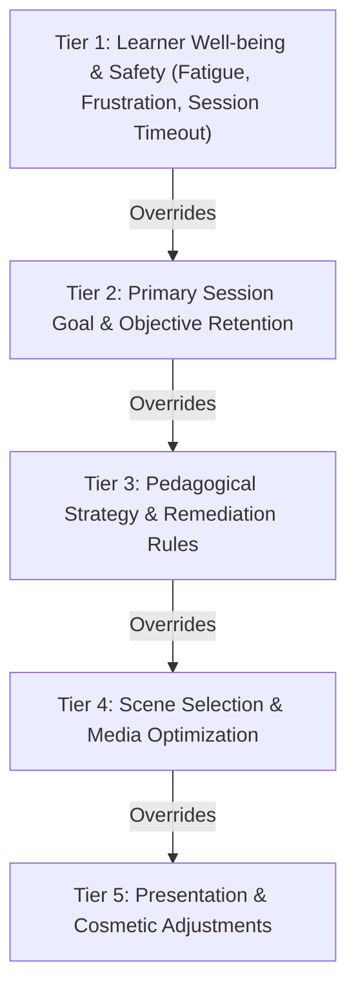
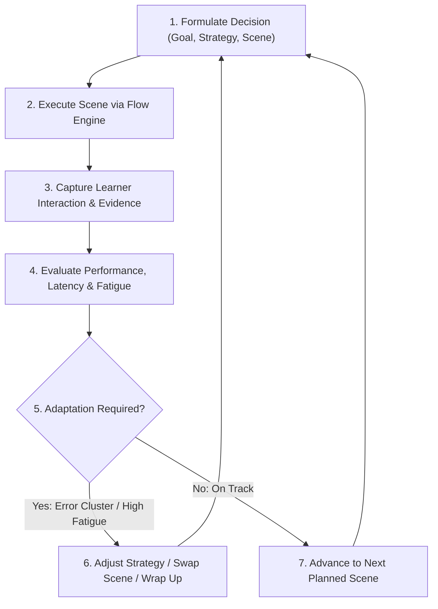
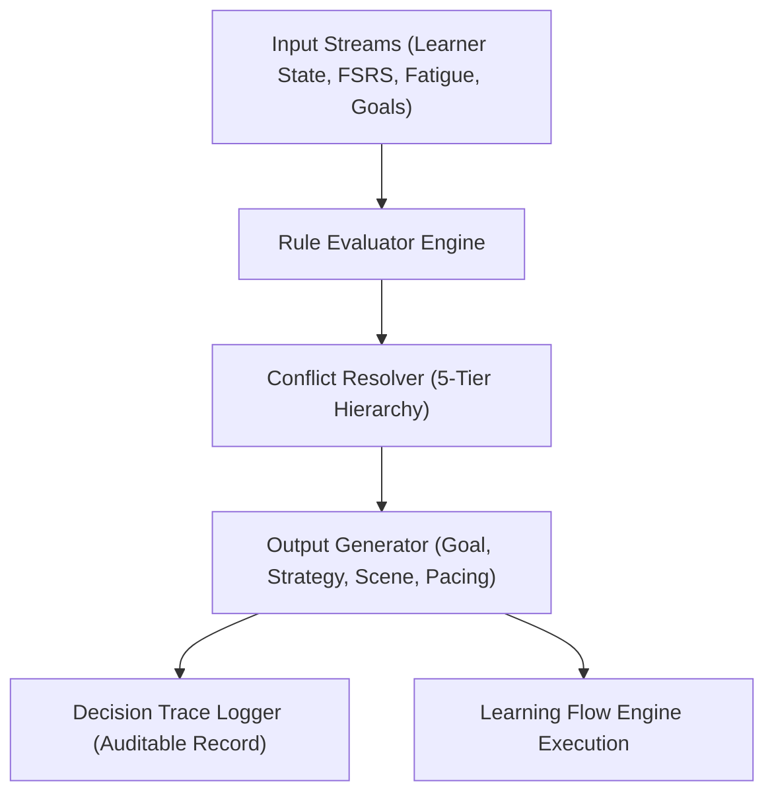
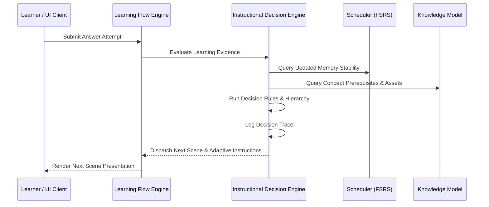

# Instructional Decision Engine — Pedagogical Decision Architecture

## 1. Executive Summary & Purpose

The **Instructional Decision Engine** is the core reasoning subsystem of Product Brain in Learning Engine 2.0. It defines **HOW** the AI Teacher evaluates pedagogical inputs, resolves decision conflicts, formulates teaching plans, selects strategies and scenes, dynamically adapts lessons during execution, and generates auditable decision logs.

The engine operates on a fundamental principle: **Teaching decisions belong exclusively to Product Brain.** Presentation clients render scenes and capture learner interactions, but Product Brain alone decides what to teach, how to teach, when to teach, and how to adapt.

---

## 2. Decision Inputs Contract

The Instructional Decision Engine evaluates 11 comprehensive input streams before and during a session:

1. **Learner Model**: Long-term historical profile, learning velocity, cognitive strengths, and subject mastery history.
2. **Knowledge Model**: Canonical hierarchy (World → Topic → Module → Lesson → Concept → Knowledge Unit → Asset), prerequisites, difficulty ratings, and semantic relationships.
3. **Session Context**: Active environment variables including current phase, queue position, elapsed time, and platform capabilities.
4. **Learning Evidence**: Stream of real-time interaction data, attempt correctness, latencies, error types, and self-reported ratings.
5. **Scheduler State**: FSRS memory stability ($S$), difficulty ($D$), retrievability ($R$), and overdue item queue distributions.
6. **Motivation Index**: Learner engagement level, current streak status, recent success momentum, and emotional state.
7. **Fatigue Index**: Accumulated cognitive fatigue measured by session duration, error spikes, and response latency degradation.
8. **Confidence Index**: Metacognitive self-efficacy scores and calibration accuracy (Confidence vs Actual Accuracy).
9. **Mastery Index**: Proportion of target domain concepts exceeding the required retention threshold ($R \ge 0.90$).
10. **Time Available**: Allocated study window (e.g., 5-minute quick session vs 30-minute deep study block).
11. **Learning Objectives**: Targeted pedagogical outcomes (e.g., `DURABLE_RECALL`, `TYPED_PRODUCTION`, `RAPID_FAMILIARIZATION`).

---

## 3. Decision Outputs Contract

The Instructional Decision Engine generates 10 explicit operational outputs:

1. **Teaching Goal**: Resolves the session's overarching target (e.g., "Remediate 3 lapsed grammar concepts while clearing 10 overdue vocabulary reviews").
2. **Teaching Strategy**: Selects the operational pedagogical strategy (e.g., `TYPED_PRODUCTION`, `INITIAL_EXPOSURE`, `REMEDIATION_TEACHING`).
3. **Scene Selection**: Selects the exact scene from the `LearningSceneLibrary` to execute next.
4. **Difficulty Adjustment**: Scales prompt difficulty, distractor plausibility, hint availability, or typing strictness.
5. **Session Planning**: Formulates the multi-phase session structure (Warm-up → Teaching → Practice → Challenge → Review → Reflection → Summary).
6. **Feedback Style**: Determines feedback delivery mode (e.g., Immediate supportive feedback vs Delayed unassisted evaluation).
7. **Transition Decision**: Dictates phase progression, stage skips, or emergency wrap-ups.
8. **Reflection Decision**: Triggers metacognitive reflection, self-assessment, or journal prompts at key boundaries.
9. **Review Decision**: Re-queues lapsed items for intra-session review or reschedules them in FSRS.
10. **Session Completion Decision**: Determines when session targets are fulfilled or when fatigue mandates early termination.

---

## 4. Decision Rules Framework

The engine applies a multi-variate rule framework to map learner states to pedagogical decisions:

| Learner / Cognitive Scenario | Primary Decision Input Signals | Engine Decision Output |
|---|---|---|
| **High Fatigue** | Fatigue Index > 0.75 OR Latency Spike > 2.0x | Abort `ChallengePhase`; transition to `ReviewPhase` with low-cognitive-load scenes; recommend early session wrap-up. |
| **Low Confidence** | Confidence Index < 0.40 AND High Error Rate | Inject high-confidence `WarmUp` items; switch to `GuidedExplanationScene` with supportive hints; use encouraging feedback style. |
| **High Mastery** | Mastery Index > 0.85 AND $R \ge 0.95$ | Enable `TypedRecallScene` or `BossChallengeScene`; skip redundant `TeachingPhase`; accelerate to advanced topics. |
| **Low Retention** | Overdue FSRS items > 20 AND $S < 3.0$ days | Prioritize `ReviewPhase`; suppress new item introductions; execute `InterleavedPractice` across lapsed concepts. |
| **Limited Available Time** | Available Time $\le$ 5 minutes | Formulate compact 5-item high-yield review plan; execute `SpeedRoundScene` or rapid `MultipleChoiceScene`; skip Reflection phase. |
| **Repeated Mistakes** | Consecutive Error Count $\ge$ 3 on same Concept | Trigger `RemediationTeaching`; present `ConceptIntroductionScene` or `WorkedExampleScene`; downgrade item difficulty. |
| **Fast Improvement** | 5 consecutive correct answers with low latency | Escalate difficulty; enable unassisted `FreeRecallScene` or `ChallengeScene`; reduce hint availability. |
| **Long Inactivity** | Days since last session > 14 days | Insert gentle `WarmUp` phase; execute diagnostic `AssessmentScene`; rebuild momentum before introducing new concepts. |
| **High Motivation** | Streak > 7 days AND High Success Rate | Formulate ambitious Session Goal; enable `MissionScene` or `CapstoneScene`; introduce challenging new topics. |
| **Mixed Mastery** | Module contains both $R > 0.90$ and $R < 0.50$ items | Execute `MixedReviewScene`; interleave mastered items as positive reinforcement between lapsed items. |

---

## 5. Decision Hierarchy & Conflict Resolution

When multiple rules trigger simultaneously, the engine applies a strict **5-Tier Priority Hierarchy** to resolve conflicts deterministically:

1. **Tier 1 (Highest Priority) — Learner Safety & Well-being**: Fatigue limits, extreme frustration triggers, and time limits OVERRIDE all instructional goals. If a learner is exhausted, the engine terminates the session early regardless of un-cleared review queues.
2. **Tier 2 — Objective & Retention Goals**: FSRS overdue queues and primary learning goals take precedence over general strategy preferences.
3. **Tier 3 — Pedagogical Strategy Rules**: Strategy eligibility (e.g., requiring initial exposure before typed recall) governs scene selection options.
4. **Tier 4 — Scene Selection**: Scene matching based on available media assets and domain suitability.
5. **Tier 5 (Lowest Priority) — Presentation Preferences**: Formatting and cosmetic adjustments.

---

## 6. Adaptive Teaching Engine

The Instructional Decision Engine operates as a continuous closed-loop feedback controller during live session execution:

- **Micro-Adaptations**: Adjusting intra-scene difficulty, hint availability, or option counts based on immediate attempt latency.
- **Macro-Adaptations**: Swapping planned scene categories (e.g., dropping from `ChallengePhase` to `TeachingPhase` after an error cluster) or ending the session early when fatigue thresholds are breached.

---

## 7. Decision Trace & Auditability

Every decision generated by the engine produces an immutable, structured **Decision Trace** record. This ensures that every teaching choice can be explained, debugged, and audited.

### Decision Trace Record Structure
- **`timestamp`**: ISO-8601 execution timestamp.
- **`sessionId`**: Unique identifier of active study session.
- **`triggerEvent`**: Event that invoked decision (e.g., `SESSION_START`, `ANSWER_SUBMITTED`, `FATIGUE_THRESHOLD_BREACHED`).
- **`inputSnapshot`**: Copy of input parameters (Fatigue, Motivation, Stability, Latency).
- **`activeRulesTriggered`**: List of rule IDs that evaluated to true.
- **`conflictResolutionLog`**: Log of priority hierarchy overrides applied.
- **`selectedOutput`**: Resulting Teaching Goal, Strategy, Scene ID, and Difficulty parameters.
- **`pedagogicalRationale`**: Human-readable explanation of *Why* this decision was made.

---

## 8. Architectural Relationship & Flow Diagrams

### 8.1. Decision Pipeline Diagram

### 8.2. Subsystem Interaction Flow

---

## 9. Cross-References

This specification aligns with [`PRODUCT_PHILOSOPHY.md`](PRODUCT_PHILOSOPHY.md), [`PRODUCT_BRAIN_SPECIFICATION.md`](PRODUCT_BRAIN_SPECIFICATION.md), [`KNOWLEDGE_MODEL.md`](KNOWLEDGE_MODEL.md), [`LEARNING_EXPERIENCE_ARCHITECTURE.md`](LEARNING_EXPERIENCE_ARCHITECTURE.md), [`LEARNING_SCENE_FRAMEWORK.md`](LEARNING_SCENE_FRAMEWORK.md), [`LEARNING_SCENE_LIBRARY.md`](LEARNING_SCENE_LIBRARY.md), and [`REPOSITORY_CONSTITUTION.md`](REPOSITORY_CONSTITUTION.md).
