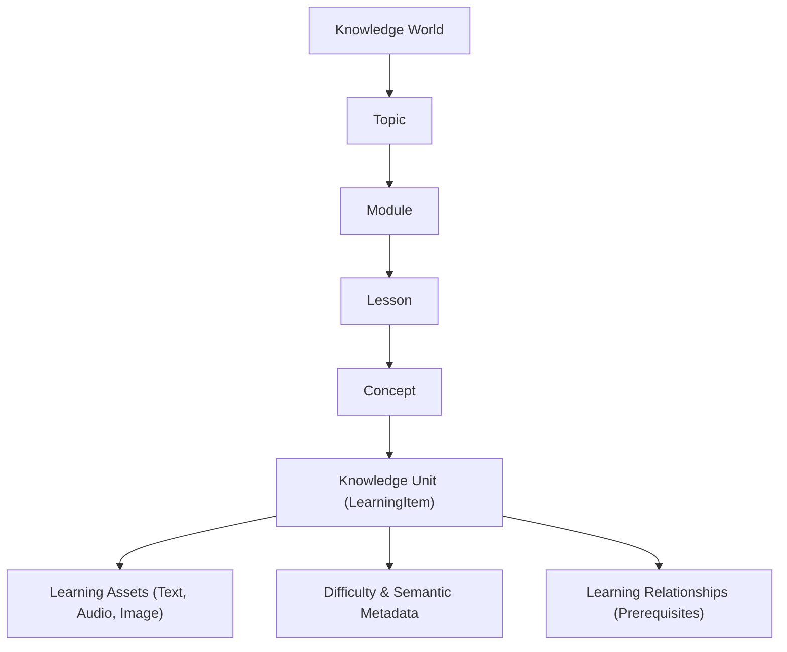
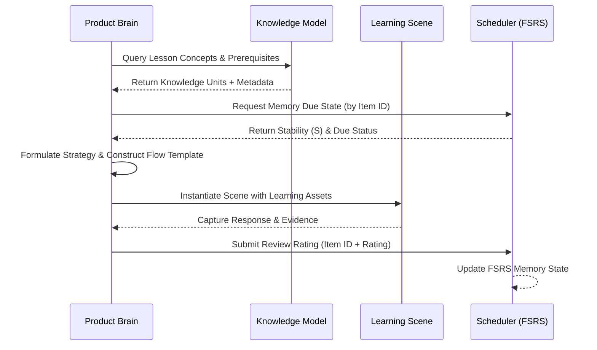

# Knowledge Model Specification — Canonical Subject-Independent Blueprint

## 1. Overview & Philosophy

The **Canonical Knowledge Model** defines how educational knowledge is structured, organized, and linked within Learning Engine 2.0. 

A fundamental architectural requirement of Learning Engine is **subject independence**: the Knowledge Model must represent any domain of human learning—whether vocabulary acquisition, interactive stories, medical physics, foreign languages, computer science, or higher mathematics—using a single unified schema.

The Knowledge Model represents *what* is being taught. It works hand-in-hand with [`PRODUCT_BRAIN_SPECIFICATION.md`](PRODUCT_BRAIN_SPECIFICATION.md), which decides *how* and *when* to teach.

---

## 2. Core Knowledge Concepts

### 2.1. Knowledge World
The top-level root container representing an entire subject domain or curriculum universe (e.g., "Japanese Language", "Radiation Oncology Physics", "Data Structures & Algorithms").

### 2.2. Topic
A major thematic area within a Knowledge World (e.g., "N3 Kanji & Vocabulary", "Dosimetry & Beam Calibration", "Tree Data Structures").

### 2.3. Module
A focused instructional unit grouping related lessons toward a sub-goal (e.g., "Food & Dining Vocabulary", "Brachytherapy Principles", "Binary Search Trees").

### 2.4. Lesson
The atomic study container selected by the learner or assigned by Product Brain, containing a curated sequence of Knowledge Units.

### 2.5. Concept
An abstract pedagogical idea or mental model to be acquired (e.g., "Transitive vs. Intransitive Verbs", "Inverse Square Law", "AVL Tree Rotation"). A Concept is independent of presentation form.

### 2.6. Knowledge Unit
The core atomic item of learnable content (corresponding to a `LearningItem`). It encapsulates specific prompt materials, answer definitions, and semantic metadata for a single item.

### 2.7. Learning Asset
A specific media component attached to a Knowledge Unit, such as text strings, Markdown passages, audio clips (MP3/PCM), images (PNG/SVG), or vector diagrams.

### 2.8. Learning Relationship
A directed semantic link between two Knowledge Units or Concepts (e.g., `PREREQUISITE_OF`, `SYNONYM_OF`, `CONTRASTS_WITH`, `EXAMPLE_OF`).

### 2.9. Difficulty Metadata
Qualitative and quantitative complexity attributes associated with a Knowledge Unit (e.g., intrinsic cognitive load rating, recommended target stage, expected response time).

### 2.10. Prerequisite
A structural rule specifying that Concept A or Knowledge Unit A must be mastered before Concept B or Knowledge Unit B is introduced.

### 2.11. Learning Dependency
A soft behavioral link indicating that reviewing or practicing Knowledge Unit A enhances comprehension or recall of Knowledge Unit B.

### 2.12. Semantic Tag
Metadata tags assigned to Knowledge Units for pedagogical filtering and scene adaptation (e.g., `#grammar`, `#audio-supported`, `#high-yield`, `#formula`, `#clinical-case`).

### 2.13. Learning Objective Mapping
Rules binding a Knowledge Unit or Concept to specific `LearningObjective` types (e.g., `DURABLE_RECALL`, `RAPID_FAMILIARIZATION`, `CONCEPTUAL_DISCRIMINATION`).

### 2.14. Content Metadata
Bibliographic and administrative provenance metadata attached to content packages (e.g., author, version, license, package ID, creation date).

### 2.15. Evidence Mapping
The rules mapping learner interactions (e.g., attempt correctness, self-reported rating, response latency) to updates in the Knowledge Model and FSRS memory state.

---

## 3. Universal Domain Mapping Examples

The Canonical Knowledge Model accommodates diverse subject domains without modifying core contracts:

| Domain | Knowledge World | Topic | Module | Lesson | Concept | Knowledge Unit | Learning Assets |
|---|---|---|---|---|---|---|---|
| **Vocabulary** | Japanese | JLPT N3 | Daily Life | Dining Out | Food Ordering | `taberu` (to eat) | Text, Audio, Kanji Image |
| **Interactive Story** | English Lit | Short Stories | Mystery | Chapter 1 | Foreshadowing | Clue Discovery | Passage Text, Illustration |
| **Medical Physics** | Radiation Oncology | Dosimetry | Photon Beams | Beam Calibration | Inverse Square Law | PDD Calculation | Formula Text, Diagram |
| **Language Course** | Spanish | Grammar | Subjunctive Mood | Present Subjunctive | Expressing Doubt | *Dudo que venga* | Sentence Audio, Grammar Note |
| **Technical Course** | Computer Science | Algorithms | Graph Theory | Shortest Path | Dijkstra's Algorithm | Priority Queue Step | Code Snippet, Trace Diagram |

---

## 4. Subsystem Interaction Architecture

### 4.1. How Product Brain Reads Knowledge Model
Product Brain queries the Knowledge Model to:
- Inspect structural prerequisites and dependencies before selecting the next item.
- Read `Difficulty Metadata` and `Semantic Tags` to formulate a `TeachingStrategy`.
- Map item capabilities to appropriate `LearningObjective` types.

### 4.2. How Learning Scene Consumes Knowledge Model
The `LearningScene` projector extracts `LearningAssets` (text, audio, images) attached to a `KnowledgeUnit` and maps them into semantic stage parameters (e.g., rendering an image block for `IMAGE_RECALL` or audio block for `LISTENING_RECALL`).

### 4.3. How Scheduler Remains Independent from Knowledge Model
The Scheduler (FSRS calculator) operates exclusively on abstract `ReviewEvent` history, memory stability ($S$), difficulty ($D$), and elapsed time ($t$). **The Scheduler has zero awareness of Content Semantics, Topics, or Domains.** It receives item IDs and outputs due dates and stability metrics.

---

## 5. Architectural Relationship Diagrams

### 5.1. Structural Model Hierarchy

### 5.2. Runtime System Data Flow

---

## 6. Alignment with Product Brain Blueprint

This Knowledge Model specification directly fulfills the requirements of [`PRODUCT_BRAIN_SPECIFICATION.md`](PRODUCT_BRAIN_SPECIFICATION.md) and enforces [`REPOSITORY_CONSTITUTION.md`](REPOSITORY_CONSTITUTION.md). All future content parsers, database schemas, and API projections MUST conform strictly to this model.
