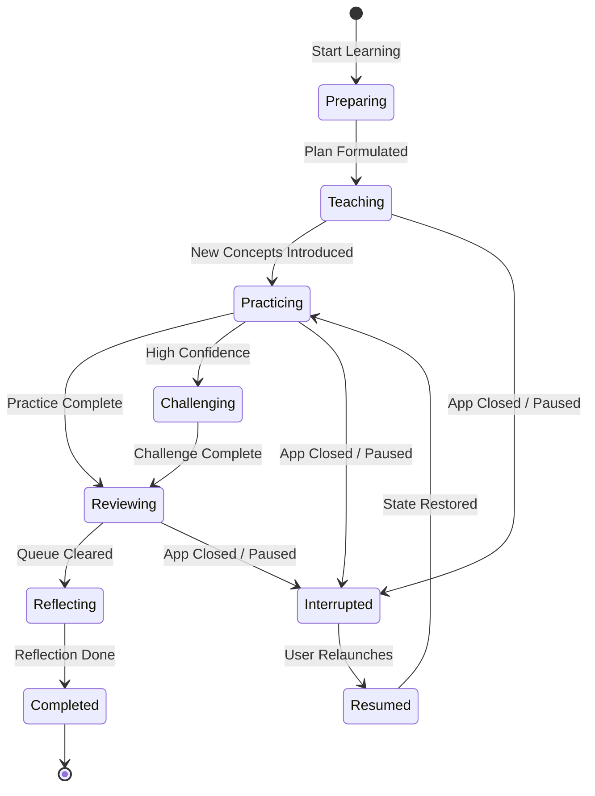
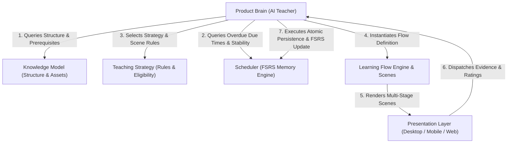
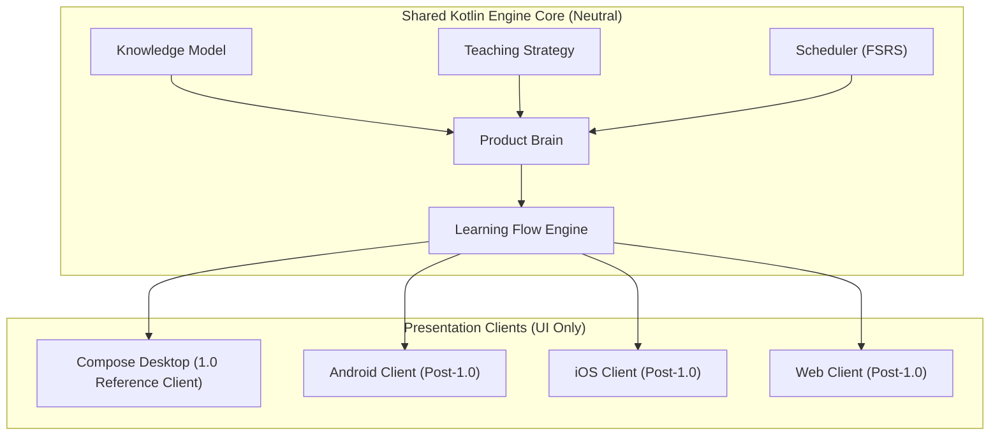

# Learning Experience Architecture — End-to-End Session Journey Specification

## 1. Overview & Vision

The **Learning Experience Architecture** defines how an AI Teacher (**Product Brain**) conducts an entire learning session from the moment the learner presses **"Start Learning"** to final **"Session Completion"**.

Learning Engine 2.0 is an adaptive **Teaching Engine**—not a flashcard application or Anki clone. It does not treat learning as a static sequence of front/back cards. Instead, it conducts a structured, adaptive, multi-phase lesson tailored to the learner's cognitive state, memory stability, and learning goals.

This document serves as the long-term architectural blueprint for how sessions are planned, conducted, adapted, and concluded across Desktop, Mobile, and Web presentation clients.

---

## 2. The 12 Core Session Concepts

### 2.1. Learning Session Lifecycle
The complete operational lifespan of a study session, spanning diagnosis, initialization, phase progression, adaptation, reflection, and completion.

### 2.2. Session Diagnosis
The pre-session assessment executed by Product Brain to evaluate current learner fatigue, available time, motivation state, memory stability, and recent error patterns.

### 2.3. Session Goal
The high-level target established for the active session (e.g., "Master 5 new concepts in JLPT N3 Grammar while clearing 12 overdue reviews").

### 2.4. Teaching Plan
The tactical sequence of phases, item allocations, and scene strategy rules formulated by Product Brain to fulfill the Session Goal.

### 2.5. Warm-up
The opening phase designed to activate working memory, build learner momentum, and boost confidence using low-cognitive-load, high-stability review items.

### 2.6. Teaching Phase
The instructional phase introducing new `Concepts` or re-teaching lapsed knowledge units through rich, multi-modal explanatory materials (text, audio, diagrams, usage contexts).

### 2.7. Practice Phase
The guided application phase featuring multi-modal scene rotation (Listening Recall, Prompt Recall, Contextual Identification) with immediate feedback to construct retrieval pathways.

### 2.8. Challenge Phase
The high-fidelity testing phase evaluating mastery boundaries through unassisted recall, typed recall, distractor discrimination, or problem-solving.

### 2.9. Review Phase
The consolidation phase reviewing items introduced in the current session alongside pending FSRS overdue items to reinforce long-term memory stability.

### 2.10. Reflection Phase
The cognitive closure phase where Product Brain presents a brief metacognitive summary of items requiring future focus.

### 2.11. Session Summary
The analytics display presenting session duration, items mastered, accuracy rate, streak progress, and next recommended study time.

### 2.12. Session Completion
The final state transition logging review events, updating FSRS memory states, updating long-term learner models, and safely persisting session artifacts.

---

## 3. Session Context & State Contracts

### 3.1. Session Context
Product Brain inspects the following pre-session context variables before constructing the Teaching Plan:

- **Current Learner State**: Baseline knowledge level, historical acquisition velocity, target subject.
- **Memory Stability ($S$)**: FSRS memory stability distributions across all candidate items.
- **Available Time**: Allocated study window (e.g., 5-minute quick session vs. 30-minute deep study).
- **Fatigue Index**: Accumulated cognitive fatigue from prior sessions or current session duration.
- **Motivation State**: Streak status, recent success rates, and engagement history.
- **Learning Objective**: Targeted outcomes (e.g., `DURABLE_RECALL`, `RAPID_FAMILIARIZATION`).
- **Knowledge Domain**: Active subject domain (Vocabulary, Physics, Story, Language, Technical).
- **Recent Mistakes**: Lapsed items or high-error clusters requiring remediation.
- **Current Mastery**: Proportion of domain concepts exceeding target retention thresholds.

### 3.2. Session State Machine

A study session evolves through explicit, deterministic state transitions:

- **`Preparing`**: Product Brain diagnoses context and formulates the `TeachingPlan`.
- **`Teaching`**: Introducing new material or re-explaining lapsed concepts.
- **`Practicing`**: Guided multi-modal scene rotation.
- **`Challenging`**: High-difficulty unassisted recall.
- **`Reviewing`**: Consolidated review of session and overdue FSRS items.
- **`Reflecting`**: Metacognitive summary and feedback.
- **`Completed`**: Session finished, stats logged, models persisted.
- **`Interrupted`**: Session paused or application closed mid-session.
- **`Resumed`**: Atomic restoration of session state and current item position upon relaunch.

---

## 4. Experience Flow & Subsystem Synergy

Product Brain acts as the maestro coordinating four core subsystem layers:

1. **Knowledge Model Contribution**: Supplies domain hierarchy (World → Topic → Module → Lesson → Concept), prerequisites, difficulty metadata, and multi-modal assets (text, audio, image).
2. **Teaching Strategy Contribution**: Determines exercise eligibility (e.g., enabling typed recall, requiring listening-first recall) and scene rotation rules.
3. **Scheduler (FSRS) Contribution**: Computes item due dates and memory stability ($S$) without dictating presentation formats or teaching logic.
4. **Learning Scene Contribution**: Formulates the exact multi-stage presentation definitions rendered by presentation clients.

---

## 5. Adaptive Experience Matrix

Product Brain continuously monitors session context and adaptively alters session flow based on real-time learner signals:

| Learner Condition | Product Brain Adaptive Action |
|---|---|
| **Succeeds Continuously** | Accelerates progression to `Challenging` state; enables Typed Recall; increases new item introduction rate. |
| **Struggles / Errors** | Inserts supportive hint scenes; drops back from `Challenging` to `Practicing`; provides explanatory teaching blocks; reduces session difficulty. |
| **Tired / High Fatigue** | Shortens remaining session queue; suppresses high-cognitive-load scenes; prioritizes low-friction review items; recommends session wrap-up. |
| **Limited Available Time** | Constructs a compact 5-item high-yield review session; skips low-priority new teaching phases. |
| **Loses Motivation** | Inserts high-confidence warm-up items; displays streak encouragement; celebrates small mastery milestones. |
| **Mastered Topic** | Transitions topic to maintenance review status; expands learning scope to adjacent prerequisite topics. |

---

## 6. Complete Domain Session Walkthroughs

### 6.1. Vocabulary Learning Session
- **Objective**: Learn 3 new JLPT N3 vocabulary items and review 5 overdue words.
- **Phase Transitions**: `Preparing` → `Warm-up` (3 high-confidence words) → `Teaching` (presenting 3 new kanji compounds with native audio & context) → `Practicing` (rotated listening & text recall) → `Challenging` (typed recall for new words) → `Reviewing` (5 overdue items) → `Reflecting` → `Completed`.
- **Expected Outcome**: 3 new words added to active memory; 5 overdue items scheduled for future review.

### 6.2. Interactive Story Session
- **Objective**: Read Chapter 2 of an English Mystery story while mastering 4 key narrative terms.
- **Phase Transitions**: `Preparing` → `Warm-up` (recap Chapter 1 plot points) → `Teaching` (read Chapter 2 passage with highlighted vocabulary) → `Practicing` (contextual comprehension check scenes) → `Challenging` (unassisted sentence translation) → `Reviewing` (vocabulary consolidation) → `Reflecting` → `Completed`.
- **Expected Outcome**: Story progression achieved; narrative vocabulary retained in context.

### 6.3. Language Course Session
- **Objective**: Master Spanish Present Subjunctive trigger phrases (*dudo que...*, *es necesario que...*).
- **Phase Transitions**: `Preparing` → `Warm-up` (Indicative verb review) → `Teaching` (Subjunctive rule explanation & audio examples) → `Practicing` (audio discrimination between Indicative and Subjunctive) → `Challenging` (sentence transformation via typing) → `Reviewing` (mixed grammar queue) → `Reflecting` → `Completed`.
- **Expected Outcome**: Subjunctive trigger rules internalized; active production verified via typing.

### 6.4. Medical Physics Session
- **Objective**: Master Percentage Depth Dose (PDD) calculations in Radiation Oncology Dosimetry.
- **Phase Transitions**: `Preparing` → `Warm-up` (Inverse Square Law formula review) → `Teaching` (PDD definition, photon energy curves, and calibration setup diagram) → `Practicing` (diagram identification and variable selection) → `Challenging` (step-by-step PDD calculation problem) → `Reviewing` (overdue dosimetry concepts) → `Reflecting` → `Completed`.
- **Expected Outcome**: Quantitative understanding of PDD curves verified through calculation.

### 6.5. Technical Certification Session
- **Objective**: Master Dijkstra's Shortest Path Algorithm for Cloud Infrastructure Certification.
- **Phase Transitions**: `Preparing` → `Warm-up` (Graph representation review: Adjacency Matrix vs List) → `Teaching` (Dijkstra algorithm steps & code snippet animation) → `Practicing` (tracing priority queue updates for a sample graph) → `Challenging` (identifying shortest path under edge weight changes) → `Reviewing` (overdue networking items) → `Reflecting` → `Completed`.
- **Expected Outcome**: Algorithmic step trace mastered; exam-style scenario passed.

### 6.6. General Knowledge Session
- **Objective**: Master European Capital Cities and Geography.
- **Phase Transitions**: `Preparing` → `Warm-up` (Quick-fire review of 5 known capitals) → `Teaching` (Introduce 3 new Baltic capitals with map images & flag assets) → `Practicing` (Map location matching scenes) → `Challenging` (Direct prompt recall without multiple choice options) → `Reviewing` (General geography queue) → `Reflecting` → `Completed`.
- **Expected Outcome**: Baltic geography knowledge acquired; 100% daily goal progress logged.

---

## 7. Learning Experience Principles

1. **Session Coherence**: A session must feel like a unified, purposeful lesson, not a random heap of disconnected cards.
2. **Non-Repetitive Experience**: Presentation formats rotate dynamically to prevent rote pattern matching and foster flexible retrieval pathways.
3. **Purposeful Transitions**: Every phase transition (Warm-up → Teaching → Practice → Challenge) must have a clear pedagogical intent based on real-time learner evidence.
4. **Zero-Friction Learner Agency**: The learner presses **Start Learning** and is guided by Product Brain. Manual mode selection, deck filter tuning, and scheduling management are eliminated.
5. **Product Brain Authority**: Product Brain alone owns session planning, strategy derivation, and flow orchestration. Presentation UI renders scenes and dispatches user interactions without altering pedagogical logic.

---

## 8. Multi-Platform Architecture Alignment

This architecture ensures that Desktop, Android, iOS, and Web presentation clients consume the **exact same** Product Brain, Session Lifecycle, and Flow Engine without duplicating teaching rules or scheduling logic.

---

## 9. Cross-References

This specification aligns with [`PRODUCT_PHILOSOPHY.md`](PRODUCT_PHILOSOPHY.md), [`PRODUCT_BRAIN_SPECIFICATION.md`](PRODUCT_BRAIN_SPECIFICATION.md), [`KNOWLEDGE_MODEL.md`](KNOWLEDGE_MODEL.md), [`REPOSITORY_CONSTITUTION.md`](REPOSITORY_CONSTITUTION.md), and [`SYSTEM_OVERVIEW.md`](SYSTEM_OVERVIEW.md).
