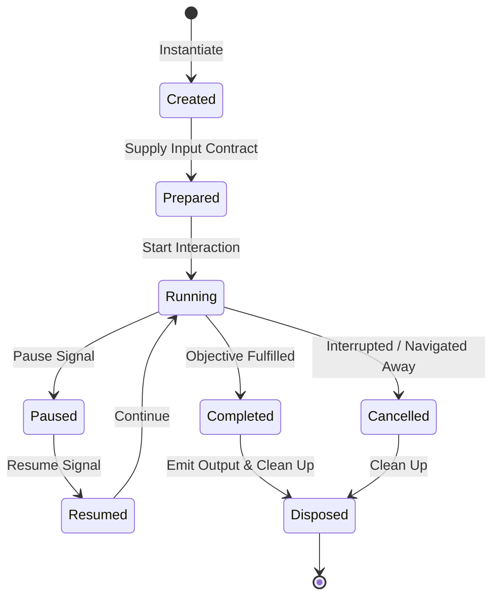
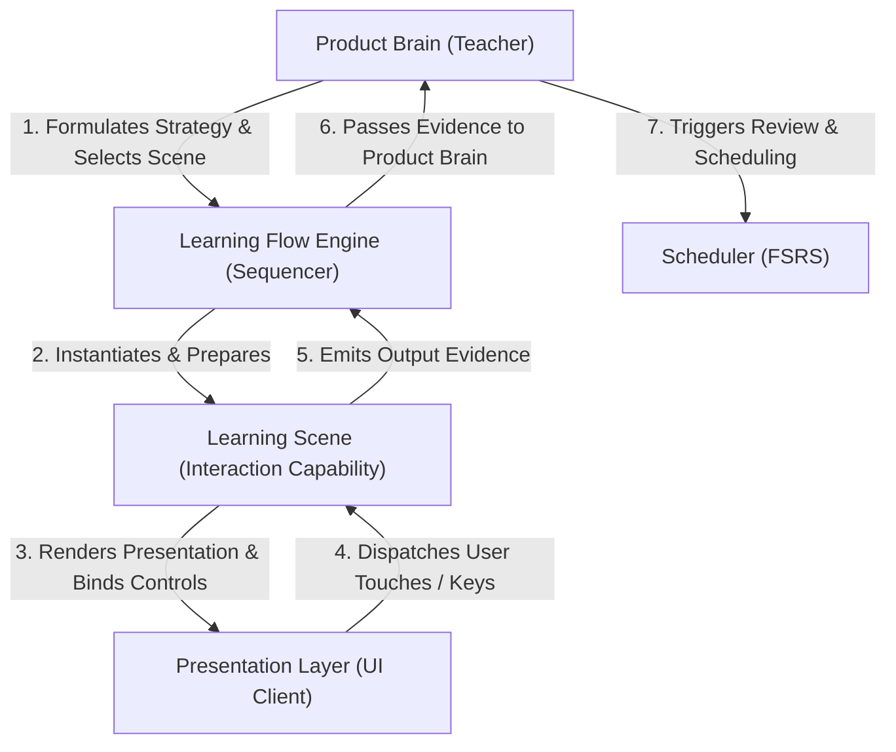

# Learning Scene Framework — Canonical Interaction Blueprint

## 1. Executive Summary & Conceptual Identity

The **Learning Scene Framework** defines the canonical architectural specification for every educational interaction capability within Learning Engine 2.0.

### What is a Learning Scene?
A **Learning Scene** is a reusable, platform-neutral **educational interaction capability** orchestrated by Product Brain to achieve a specific teaching objective. It encapsulates the pedagogical rules, prompt presentation requirements, response collection mechanics, and evidence generation rules for an interaction.

### What a Learning Scene is NOT:
- A Learning Scene is **NOT a UI Screen** (e.g., an Android Activity or Desktop Window).
- A Learning Scene is **NOT a Page Layout** (e.g., a Compose screen composable or HTML template).
- A Learning Scene is **NOT a UI Widget** (e.g., a button, text field, or card component).

Presentation clients (Compose Desktop, Android Views/Compose, iOS SwiftUI, Web UI) render scenes visually, but the educational interaction contract itself lives entirely within the platform-neutral core.

---

## 2. The 12 Framework Concepts

### 2.1. What is a Learning Scene?
The fundamental unit of educational interaction. It defines how a learner engages with specific `KnowledgeUnits` under a defined `TeachingStrategy`.

### 2.2. Responsibilities
- Presenting semantic learning assets (text, audio, image, diagrams) according to scene rules.
- Collecting learner interaction events, attempts, latencies, and self-reported ratings.
- Evaluating attempt correctness and generating structured `LearningEvidence`.
- Managing transient interaction state during execution.

### 2.3. Non-Responsibilities
- **Does NOT decide teaching strategy** (owned by Product Brain).
- **Does NOT calculate scheduling or review intervals** (owned by FSRS Scheduler).
- **Does NOT mutate learner profile or long-term models directly** (owned by Application Use Cases).
- **Does NOT execute filesystem I/O or database persistence** (owned by Infrastructure).
- **Does NOT execute platform UI rendering directly** (owned by Presentation Layer).

### 2.4. Scene Lifecycle
The deterministic operational lifecycle of a scene instance from creation to disposal (`Created` → `Prepared` → `Running` → `Paused` → `Resumed` → `Completed` / `Cancelled` → `Disposed`).

### 2.5. Scene Input Contract
The immutable data payload required to initialize a scene instance, including `LearningObjective`, `KnowledgeUnits`, `LearningAssets`, `DifficultyMetadata`, `TeachingStrategy`, and `SessionContext`.

### 2.6. Scene Output Contract
The structured data payload returned upon scene completion, including `LearningEvidence`, accuracy performance, attempt latency, confidence estimations, and completion status.

### 2.7. Scene Context
The active environmental variables during scene execution, such as session elapsed time, current queue position, consecutive error counts, and device capabilities (e.g., audio playback support).

### 2.8. Scene State
The internal, transient state of a running scene instance (e.g., `UNREVEALED_PROMPT`, `ANSWER_SUBMITTED`, `FEEDBACK_PRESENTED`, `RATING_READY`).

### 2.9. Scene Events
The stream of domain and interaction events emitted during execution (e.g., `PromptPresented`, `AudioPlaybackRequested`, `AnswerAttempted`, `AnswerRevealed`, `RatingSubmitted`).

### 2.10. Scene Result
The qualitative and quantitative evaluation of a completed scene interaction (e.g., `SUCCESSFUL_RECALL`, `HESITANT_RECALL`, `INCORRECT_RECALL`, or `PARTIAL_MASTERY`).

### 2.11. Scene Completion
The normal termination transition occurring when the interaction objective is fulfilled and `LearningEvidence` is emitted.

### 2.12. Scene Cancellation
The abnormal termination transition occurring when a scene is interrupted (e.g., session pause, user navigation, or session timeout) before completion.

---

## 3. Architectural Scene Categories

The framework defines nine fundamental architectural categories of Learning Scenes:

1. **Teaching Scene**: Introduces new concepts or re-explains lapsed material using rich multi-modal explanations, diagrams, audio pronunciation, and contextual usage examples.
2. **Practice Scene**: Provides guided active recall exercises (e.g., Image Recall, Listening Recall, Text Prompt Recall) with immediate answer feedback.
3. **Assessment Scene**: Evaluates mastery boundaries under unassisted, time-constrained conditions without supportive hints.
4. **Review Scene**: Consolidates session learning and overdue FSRS review items using standardized prompt/reveal/rate interactions.
5. **Reflection Scene**: Facilitates metacognitive self-evaluation and summary reflection at key session boundaries.
6. **Challenge Scene**: Presents high-difficulty, active-production tasks (such as Typed Recall, sentence transformation, or complex calculation).
7. **Motivation Scene**: Delivers positive feedback, streak milestones, and momentum-building encouragement.
8. **Recovery Scene**: Provides supportive scaffolding and hints when a learner struggles or experiences error clusters.
9. **Transition Scene**: Manages smooth pedagogical shifts between session phases (e.g., moving from Warm-up to Teaching Phase).

---

## 4. Scene Lifecycle State Machine

- **`Created`**: Scene instance instantiated in memory.
- **`Prepared`**: Scene input contract validated; assets and parameters bound.
- **`Running`**: Interaction active; presenting prompts and capturing events.
- **`Paused`**: Interaction temporarily frozen (e.g., app in background).
- **`Resumed`**: Interaction reactivated without state loss.
- **`Completed`**: Learner completed interaction; `LearningEvidence` emitted.
- **`Cancelled`**: Interaction terminated prematurely without emitting completion evidence.
- **`Disposed`**: Scene resources released.

---

## 5. Input and Output Contracts

### 5.1. Scene Input Contract Structure
- **`objective`**: Target `LearningObjective` (e.g., `DURABLE_RECALL`).
- **`knowledgeUnits`**: Target `KnowledgeUnit` list being presented.
- **`learningAssets`**: Text, audio, image, and diagram assets attached to the unit.
- **`difficultyMetadata`**: Cognitive load rating and expected latency.
- **`teachingStrategy`**: Operational rules (e.g., `includeOptionalTyping = true`).
- **`sessionContext`**: Current queue position, session elapsed time, fatigue index.
- **`learnerState`**: Historical retention and confidence metrics.

### 5.2. Scene Output Contract Structure
- **`learningEvidence`**: Structured record of learner responses and attempt evaluations.
- **`performance`**: Binary or scaled accuracy result (`CORRECT`, `INCORRECT`, `PARTIAL`).
- **`attemptLatencyMs`**: Exact elapsed time from prompt presentation to submission.
- **`confidenceChange`**: Estimated change in learner self-efficacy.
- **`masteryEstimation`**: Updated item stability estimate.
- **`completionStatus`**: `COMPLETED` or `CANCELLED`.

---

## 6. Invariant Scene Rules & Prohibitions

1. **Never Decide Teaching Strategy**: A scene MUST NOT choose which learning objective or strategy to execute; it executes the strategy provided by Product Brain.
2. **Never Decide Scheduling**: A scene MUST NOT calculate next review dates, FSRS stability curves, or decay rates.
3. **Never Modify Learner Profile Directly**: A scene MUST NOT mutate persistent learner settings or long-term historical records.
4. **Never Persist Data Directly**: A scene MUST NOT execute database or JSON file writes. Data persistence is performed by Application Use Cases.
5. **Never Bypass Product Brain**: A scene MUST NOT invoke other scenes directly or alter session flow without returning output evidence to Product Brain.

---

## 7. Subsystem Authority Matrix

- **Product Brain**: Owns pedagogical decision-making, objective resolution, and scene selection.
- **Learning Flow Engine**: Owns scene sequencing and stage transitions. Never evaluates pedagogy or teaches.
- **Learning Scene**: Owns interaction execution, attempt collection, and evidence generation.
- **Presentation Layer (UI)**: Owns visual rendering, layout, focus, audio playback, and gesture routing. Never makes teaching decisions.

---

## 8. Cross-Platform Rendering Strategy

The Learning Scene Framework guarantees **identical educational interaction behavior** across all presentation clients:

- **Compose Desktop**: Renders desktop layouts, keyboard shortcuts (`Space`, `Enter`, `1-4`), and Java Sound audio playback.
- **Android Client**: Renders mobile touch layouts, swipe gestures, native Android audio, and lock-screen controls.
- **iOS Client**: Renders SwiftUI layouts, iOS touch gestures, and AVFoundation audio.
- **Web Client**: Renders responsive web layouts, browser keyboard routing, and Web Audio API playback.

Regardless of UI platform differences, **all clients consume the exact same `LearningSceneInput` contract and emit the exact same `LearningSceneOutput` evidence.**

---

## 9. Alignment with System Architecture

This framework aligns with [`PRODUCT_PHILOSOPHY.md`](PRODUCT_PHILOSOPHY.md), [`PRODUCT_BRAIN_SPECIFICATION.md`](PRODUCT_BRAIN_SPECIFICATION.md), [`KNOWLEDGE_MODEL.md`](KNOWLEDGE_MODEL.md), [`LEARNING_EXPERIENCE_ARCHITECTURE.md`](LEARNING_EXPERIENCE_ARCHITECTURE.md), and [`REPOSITORY_CONSTITUTION.md`](REPOSITORY_CONSTITUTION.md).
