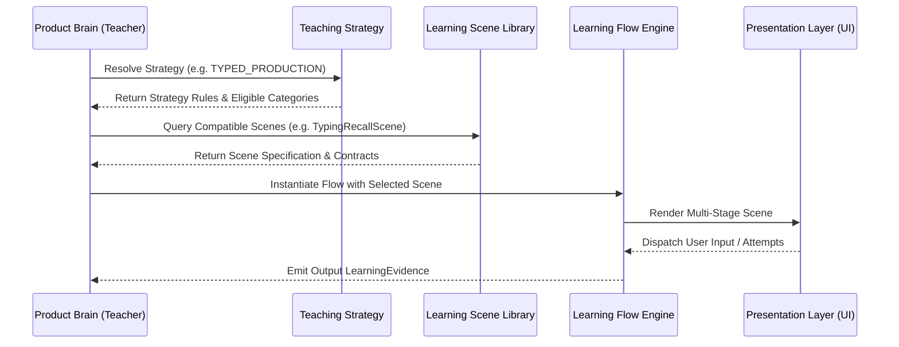

# Canonical Learning Scene Library — Pedagogical Interaction Catalog

## 1. Executive Summary & Taxonomy Standards

The **Canonical Learning Scene Library** defines the complete catalog of reusable educational interaction capabilities available to Product Brain in Learning Engine 2.0.

A Learning Scene is **NOT a UI screen, page layout, or widget**. It is a platform-neutral **educational interaction capability** orchestrated by Product Brain to achieve specific teaching objectives.

---

## 2. Standard Taxonomy Definitions

All scenes in the library adhere to standardized taxonomy classifications:

### 2.1. Memory & Cognitive Types
- **Recognition**: Identifying target knowledge among options.
- **Recall**: Unassisted retrieval from memory.
- **Application**: Using knowledge to solve problems or transform inputs.
- **Transfer**: Applying knowledge in new, unencountered contexts.
- **Reasoning**: Analyzing logical relationships, proofs, or diagnostic cases.
- **Creativity**: Constructing original outputs, continuations, or explanations.
- **Procedural**: Executing step-by-step algorithms or multi-stage operations.
- **Conceptual**: Understanding abstract principles and relationships.
- **Spatial**: Processing visual diagrams, anatomy, or geometric structures.
- **Auditory**: Processing native speech, pronunciation, or acoustic cues.
- **Visual**: Processing images, code syntax, or written text.

### 2.2. Cognitive Load Ratings
- **Low**: Minimal working memory demand (fast recognition, simple review).
- **Medium**: Moderate working memory demand (guided recall, standard practice).
- **High**: Significant working memory demand (unassisted recall, complex diagnosis, multi-step calculation).

### 2.3. Estimated Duration
- **Very Short**: < 5 seconds.
- **Short**: 5 – 15 seconds.
- **Medium**: 15 – 45 seconds.
- **Long**: > 45 seconds.

### 2.4. Difficulty Range
- **Beginner**: Introductory scaffolding.
- **Intermediate**: Standard guided practice.
- **Advanced**: High-challenge unassisted synthesis.
- **Adaptive**: Dynamically scales with learner performance.

---

## 3. Uniform Scene Specification Template

Every scene in this library follows a 19-point specification contract:

```text
- Scene Name: [Canonical Identifier]
- Category: [Teaching / Practice / Assessment / Story / Speaking / Medical / Programming / Mathematics / Reflection / Challenge]
- Purpose: [Primary pedagogical intent]
- Learning Objectives: [Target educational outcomes]
- Typical Inputs: [KnowledgeUnits, Assets, Difficulty, Strategy]
- Interaction Pattern: [Sequence of interaction stages]
- Expected Learning Evidence: [Emitted performance data & metrics]
- Strengths: [Pedagogical advantages]
- Weaknesses: [Known limitations]
- Best Used When: [Optimal learner/session conditions]
- Avoid When: [Sub-optimal conditions]
- Compatible Teaching Strategies: [Eligible Product Brain strategies]
- Possible Next Scenes: [Recommended follow-up scenes]
- Cognitive Load: [Low / Medium / High + Rationale]
- Estimated Duration: [Very Short / Short / Medium / Long]
- Supported Memory Types: [Relevant taxonomy types]
- Difficulty Range: [Beginner / Intermediate / Advanced / Adaptive]
- Adaptation Opportunities: [Dynamic scaling hooks]
- Accessibility Considerations: [Screen reader, keyboard, audio fallback rules]
```

---

## 4. Canonical Scene Library

### 4.1. Teaching Category

#### 4.1.1. Concept Introduction
- **Scene Name**: `ConceptIntroductionScene`
- **Category**: Teaching
- **Purpose**: Introduce a new `Concept` or `KnowledgeUnit` for the first time.
- **Learning Objectives**: Build initial mental models and familiarization.
- **Typical Inputs**: Text summary, audio pronunciation, visual image, usage note.
- **Interaction Pattern**: Present semantic assets → Learner reads/listens → Acknowledge continue.
- **Expected Learning Evidence**: Initial exposure timestamp, asset interaction duration.
- **Strengths**: Low pressure, builds baseline clarity.
- **Weaknesses**: Passive exposure; does not test retrieval.
- **Best Used When**: Introducing unseen items in Teaching Phase.
- **Avoid When**: Reviewing established items or during high-fatigue states.
- **Compatible Teaching Strategies**: `INITIAL_EXPOSURE`, `CONCEPTUAL_SCAFFOLDING`.
- **Possible Next Scenes**: `GuidedExplanationScene`, `ImageRecallScene`, `PromptRecallScene`.
- **Cognitive Load**: Low (explanatory passive reading).
- **Estimated Duration**: Medium (15 – 30 seconds).
- **Supported Memory Types**: Conceptual, Visual, Auditory.
- **Difficulty Range**: Beginner.
- **Adaptation Opportunities**: Expand or collapse optional example notes based on prior speed.
- **Accessibility Considerations**: Provide text alt-descriptions for visual assets; screen-reader readable.

#### 4.1.2. Guided Explanation
- **Scene Name**: `GuidedExplanationScene`
- **Category**: Teaching
- **Purpose**: Provide step-by-step breakdown of a complex rule, formula, or grammar structure.
- **Learning Objectives**: Structural comprehension of relationships.
- **Typical Inputs**: Multi-part text breakdown, diagram, rule highlights.
- **Interaction Pattern**: Step-by-step passage revelation → Interactive continue prompts.
- **Expected Learning Evidence**: Step completion rate, reading latency per step.
- **Strengths**: Prevents cognitive overload on complex topics.
- **Weaknesses**: Requires higher attention span.
- **Best Used When**: Learner struggles with a concept during practice.
- **Avoid When**: Learner has already achieved high mastery.
- **Compatible Teaching Strategies**: `REMEDIATION_TEACHING`, `DEEP_EXPLANATION`.
- **Possible Next Scenes**: `WorkedExampleScene`, `FillInTheBlankScene`.
- **Cognitive Load**: Medium (structured comprehension).
- **Estimated Duration**: Long (30 – 60 seconds).
- **Supported Memory Types**: Conceptual, Procedural, Reasoning.
- **Difficulty Range**: Intermediate.
- **Adaptation Opportunities**: Skip intermediate steps if learner demonstrates rapid comprehension.
- **Accessibility Considerations**: Full keyboard navigation across steps (`Next`, `Back`).

#### 4.1.3. Worked Example
- **Scene Name**: `WorkedExampleScene`
- **Category**: Teaching
- **Purpose**: Demonstrate a complete problem solution or sentence translation.
- **Learning Objectives**: Procedural mastery through observation.
- **Typical Inputs**: Problem statement, annotated solution steps, final result.
- **Interaction Pattern**: Present problem → Reveal solution steps progressively → Review complete solution.
- **Expected Learning Evidence**: Step reveal timing, completion confirmation.
- **Strengths**: Bridges theory and practical application.
- **Weaknesses**: Risk of passive observation without active engagement.
- **Best Used When**: Preparing for high-challenge exercises in Technical/Math/Physics domains.
- **Avoid When**: Simple vocabulary items.
- **Compatible Teaching Strategies**: `DEMONSTRATION_FIRST`, `PROCEDURAL_MASTERY`.
- **Possible Next Scenes**: `PracticeScene`, `EquationSolvingScene`, `CodeCompletionScene`.
- **Cognitive Load**: Medium.
- **Estimated Duration**: Long (30 – 45 seconds).
- **Supported Memory Types**: Application, Procedural, Reasoning.
- **Difficulty Range**: Intermediate / Advanced.
- **Adaptation Opportunities**: Allow instant expand-all for advanced learners.
- **Accessibility Considerations**: Accessible step labels and clear contrast for math/code blocks.

#### 4.1.4. Interactive Demonstration
- **Scene Name**: `InteractiveDemonstrationScene`
- **Category**: Teaching
- **Purpose**: Allow interactive exploration of parameters (e.g., beam energy slider, graph node toggle).
- **Learning Objectives**: Intuitive grasp of dynamic system behavior.
- **Typical Inputs**: Variable controls, reactive diagram/visualization asset.
- **Interaction Pattern**: Learner adjusts parameters → System updates visualization reactively → Confirm understanding.
- **Expected Learning Evidence**: Parameter exploration paths, interaction count, dwell time.
- **Strengths**: High engagement, deep intuitive learning.
- **Weaknesses**: Complex to author; requires rich media capabilities.
- **Best Used When**: Medical Physics, Mathematics, or Computer Science concepts.
- **Avoid When**: Audio/Vocabulary items.
- **Compatible Teaching Strategies**: `EXPLORATORY_LEARNING`, `VISUAL_MASTERY`.
- **Possible Next Scenes**: `GraphInterpretationScene`, `ClinicalCaseScene`.
- **Cognitive Load**: Medium.
- **Estimated Duration**: Long (45 – 90 seconds).
- **Supported Memory Types**: Conceptual, Spatial, Visual.
- **Difficulty Range**: Intermediate / Advanced.
- **Adaptation Opportunities**: Provide guided prompt targets if learner appears idle.
- **Accessibility Considerations**: Provide keyboard controls for sliders; screen reader values.

---

### 4.2. Practice Category

#### 4.2.1. Typing Recall
- **Scene Name**: `TypingRecallScene`
- **Category**: Practice
- **Purpose**: Test active production and spelling accuracy through unassisted keyboard input.
- **Learning Objectives**: Active recall, orthographic precision, production mastery.
- **Typical Inputs**: Prompt text/audio/image, expected answer string, normalization rules.
- **Interaction Pattern**: Present prompt → Learner types answer → Submit → Reveal answer → Self-rate.
- **Expected Learning Evidence**: Attempt text, exact/normalized correctness, typing latency, edit distance.
- **Strengths**: Highest active recall strength; eliminates guessing.
- **Weaknesses**: High cognitive load; sensitive to input typos.
- **Best Used When**: Learner reaches intermediate stability on vocabulary or short phrases.
- **Avoid When**: High learner fatigue or initial exposure phase.
- **Compatible Teaching Strategies**: `TYPED_PRODUCTION`, `ACTIVE_CHALLENGE`.
- **Possible Next Scenes**: `ReviewScene`, `ConfidenceRatingScene`.
- **Cognitive Load**: High (active retrieval & spelling production).
- **Estimated Duration**: Short (5 – 15 seconds).
- **Supported Memory Types**: Recall, Procedural, Auditory/Visual.
- **Difficulty Range**: Intermediate / Advanced.
- **Adaptation Opportunities**: Enable optional letter-count hint if first attempt fails.
- **Accessibility Considerations**: Full screen reader focus on input field; clear error feedback.

#### 4.2.2. Oral Recall
- **Scene Name**: `OralRecallScene`
- **Category**: Practice
- **Purpose**: Test spoken production and verbal recall.
- **Learning Objectives**: Verbal active recall and pronunciation confidence.
- **Typical Inputs**: Prompt asset, expected audio/phonetic target.
- **Interaction Pattern**: Present prompt → Learner speaks response → Reveal audio target → Self-rate.
- **Expected Learning Evidence**: Spoken attempt indicator, latency, self-reported rating.
- **Strengths**: Directly trains speaking ability.
- **Weaknesses**: Requires microphone or quiet environment.
- **Best Used When**: Language learning and vocabulary speaking practice.
- **Avoid When**: Quiet-environment restriction active.
- **Compatible Teaching Strategies**: `VERBAL_PRODUCTION`, `SPEAKING_PRACTICE`.
- **Possible Next Scenes**: `PronunciationScene`, `ShadowingScene`.
- **Cognitive Load**: Medium / High.
- **Estimated Duration**: Short (5 – 10 seconds).
- **Supported Memory Types**: Recall, Auditory, Procedural.
- **Difficulty Range**: Intermediate.
- **Adaptation Opportunities**: Fallback to Typing Recall if speech input unavailable.
- **Accessibility Considerations**: Provide alternative non-speech input fallback.

#### 4.2.3. Image Recall
- **Scene Name**: `ImageRecallScene`
- **Category**: Practice
- **Purpose**: Test visual-to-concept retrieval using image prompt assets.
- **Learning Objectives**: Visual association and spatial/semantic recall.
- **Typical Inputs**: Image asset, prompt question, expected answer.
- **Interaction Pattern**: Present image prompt → Learner recalls answer → Reveal → Rate.
- **Expected Learning Evidence**: Recall accuracy, latency, self-rating.
- **Strengths**: Leverages dual-coding theory; fast recognition.
- **Weaknesses**: Requires high-quality image assets.
- **Best Used When**: Items with rich visual media (Anatomy, Flag, Kanji, Visual Vocab).
- **Avoid When**: Abstract text-only grammar rules.
- **Compatible Teaching Strategies**: `VISUAL_RECALL`, `MULTI_MODAL_ROTATION`.
- **Possible Next Scenes**: `AudioRecallScene`, `TypingRecallScene`.
- **Cognitive Load**: Low / Medium.
- **Estimated Duration**: Short (5 – 10 seconds).
- **Supported Memory Types**: Recognition, Recall, Visual, Spatial.
- **Difficulty Range**: Beginner / Intermediate.
- **Adaptation Opportunities**: Zoom image on click/tap; toggle overlay labels.
- **Accessibility Considerations**: Mandatory alt-text description for screen readers.

#### 4.2.4. Audio Recall
- **Scene Name**: `AudioRecallScene`
- **Category**: Practice
- **Purpose**: Test auditory comprehension and listening recall.
- **Learning Objectives**: Auditory discrimination, listening comprehension.
- **Typical Inputs**: Audio clip asset, question prompt.
- **Interaction Pattern**: Play audio clip → Learner listens → Recall answer → Reveal → Rate.
- **Expected Learning Evidence**: Playback replay count, latency, self-rating.
- **Strengths**: Strengthens auditory memory pathways.
- **Weaknesses**: Ineffective in silent environments without headphones.
- **Best Used When**: Foreign language listening practice and pronunciation.
- **Avoid When**: Text-only subjects.
- **Compatible Teaching Strategies**: `LISTENING_FIRST`, `AUDITORY_ROTATION`.
- **Possible Next Scenes**: `TypingRecallScene`, `ShadowingScene`.
- **Cognitive Load**: Medium.
- **Estimated Duration**: Short (5 – 15 seconds).
- **Supported Memory Types**: Recall, Auditory.
- **Difficulty Range**: Intermediate.
- **Adaptation Opportunities**: Speed control (0.8x / 1.0x / 1.2x) playback option.
- **Accessibility Considerations**: Provide caption toggle for hearing-impaired learners.

#### 4.2.5. Free Recall
- **Scene Name**: `FreeRecallScene`
- **Category**: Practice
- **Purpose**: Test unprompted memory retrieval for a concept or topic.
- **Learning Objectives**: Pure memory retrieval without contextual hints.
- **Typical Inputs**: Minimal topic header prompt.
- **Interaction Pattern**: Present minimal header → Learner recalls everything → Reveal complete details → Self-rate.
- **Expected Learning Evidence**: Self-reported recall completeness rating, latency.
- **Strengths**: Deepest memory retrieval practice.
- **Weaknesses**: High subjective variance in self-rating.
- **Best Used When**: Reviewing high-mastery items in advanced stages.
- **Avoid When**: Initial teaching phases.
- **Compatible Teaching Strategies**: `UNASSISTED_RECALL`, `MASTERY_TEST`.
- **Possible Next Scenes**: `ReviewScene`, `SelfAssessmentScene`.
- **Cognitive Load**: High.
- **Estimated Duration**: Medium (10 – 20 seconds).
- **Supported Memory Types**: Recall, Conceptual.
- **Difficulty Range**: Advanced.
- **Adaptation Opportunities**: Reveal hints progressively if user hesitates.
- **Accessibility Considerations**: Screen-reader accessible prompt header.

#### 4.2.6. Matching
- **Scene Name**: `MatchingScene`
- **Category**: Practice
- **Purpose**: Test associative memory by pairing related terms/images.
- **Learning Objectives**: Relational association and classification.
- **Typical Inputs**: List of prompts (Column A) and list of targets (Column B).
- **Interaction Pattern**: Present two lists → Learner pairs items → Immediate feedback → Rate session.
- **Expected Learning Evidence**: Pair attempt count, errors per pair, total latency.
- **Strengths**: Engaging multi-item consolidation; medium cognitive load.
- **Weaknesses**: Process of elimination can distort accuracy signals.
- **Best Used When**: Reviewing a batch of related vocabulary or formula terms.
- **Avoid When**: Assessing single isolated items.
- **Compatible Teaching Strategies**: `BATCH_CONSOLIDATION`, `ASSOCIATIVE_LEARNING`.
- **Possible Next Scenes**: `ClassificationScene`, `ReviewScene`.
- **Cognitive Load**: Medium.
- **Estimated Duration**: Medium (15 – 30 seconds).
- **Supported Memory Types**: Recognition, Associative, Visual.
- **Difficulty Range**: Beginner / Intermediate.
- **Adaptation Opportunities**: Adjust pair count (3 to 6 pairs) based on fatigue.
- **Accessibility Considerations**: Keyboard list navigation with accessible aria-selected bindings.

#### 4.2.7. Classification
- **Scene Name**: `ClassificationScene`
- **Category**: Practice
- **Purpose**: Categorize items into defined buckets (e.g., Transitive vs. Intransitive).
- **Learning Objectives**: Taxonomic discrimination and rule application.
- **Typical Inputs**: Target items, category buckets, classification rules.
- **Interaction Pattern**: Present item → Learner selects category bucket → Feedback → Next item.
- **Expected Learning Evidence**: Category assignment accuracy, latency per item.
- **Strengths**: Teaches underlying conceptual boundaries.
- **Weaknesses**: Limited to domain items with clear categorical boundaries.
- **Best Used When**: Grammar categorization, medical diagnosis groupings, science taxonomies.
- **Avoid When**: Unrelated standalone facts.
- **Compatible Teaching Strategies**: `CATEGORICAL_DISCRIMINATION`, `TAXONOMIC_MASTERY`.
- **Possible Next Scenes**: `MultipleChoiceScene`, `PracticeScene`.
- **Cognitive Load**: Medium.
- **Estimated Duration**: Short (10 – 20 seconds).
- **Supported Memory Types**: Application, Conceptual, Reasoning.
- **Difficulty Range**: Intermediate.
- **Adaptation Opportunities**: Highlight category rule reminders on error.
- **Accessibility Considerations**: Accessible button groups for category selection.

#### 4.2.8. Sequencing
- **Scene Name**: `SequencingScene`
- **Category**: Practice
- **Purpose**: Order a set of steps or story elements into correct chronological/procedural sequence.
- **Learning Objectives**: Procedural logic, narrative order, algorithmic flow.
- **Typical Inputs**: Unordered list of step blocks.
- **Interaction Pattern**: Present unordered steps → Learner arranges sequence → Submit → Feedback.
- **Expected Learning Evidence**: Sequence correctness, step swap count, completion time.
- **Strengths**: Excellent for procedural algorithms, medical protocols, and story reconstruction.
- **Weaknesses**: Higher interaction friction on mobile touch screens if poorly designed.
- **Best Used When**: Programming algorithms, medical treatment planning, historical timelines.
- **Avoid When**: Simple single-term vocabulary.
- **Compatible Teaching Strategies**: `PROCEDURAL_SEQUENCING`, `ALGORITHMIC_MASTERY`.
- **Possible Next Scenes**: `CodeCompletionScene`, `TreatmentPlanningScene`.
- **Cognitive Load**: Medium / High.
- **Estimated Duration**: Medium (20 – 40 seconds).
- **Supported Memory Types**: Procedural, Reasoning, Spatial.
- **Difficulty Range**: Intermediate / Advanced.
- **Adaptation Opportunities**: Provide first-step anchor locked in place for beginners.
- **Accessibility Considerations**: Move Up / Move Down keyboard buttons for list reordering.

#### 4.2.9. Fill in the Blank
- **Scene Name**: `FillInTheBlankScene`
- **Category**: Practice
- **Purpose**: Complete a sentence or formula by supplying missing target words.
- **Learning Objectives**: Contextual recall and grammatical integration.
- **Typical Inputs**: Sentence text with blank placeholders, missing word target.
- **Interaction Pattern**: Present cloze passage → Learner fills blank (typing or selection) → Submit → Feedback.
- **Expected Learning Evidence**: Cloze accuracy, attempt latency, hint requests.
- **Strengths**: Teaches contextual usage rather than isolated definition.
- **Weaknesses**: Clue ambiguity if sentence context is too broad.
- **Best Used When**: Language grammar, sentence patterns, mathematical formulas.
- **Avoid When**: First time introducing a word.
- **Compatible Teaching Strategies**: `CONTEXTUAL_RECALL`, `CLOZE_PRACTICE`.
- **Possible Next Scenes**: `TypingRecallScene`, `StoryReadingScene`.
- **Cognitive Load**: Medium.
- **Estimated Duration**: Short (10 – 20 seconds).
- **Supported Memory Types**: Recall, Application, Visual.
- **Difficulty Range**: Intermediate.
- **Adaptation Opportunities**: Convert from text input to option selection if learner struggles.
- **Accessibility Considerations**: Clear screen-reader blank announcement (`blank 1`).

---

### 4.3. Assessment Category

#### 4.3.1. Multiple Choice
- **Scene Name**: `MultipleChoiceScene`
- **Category**: Assessment
- **Purpose**: Assess recognition among distractor choices.
- **Learning Objectives**: Rapid knowledge evaluation and distractor discrimination.
- **Typical Inputs**: Question prompt, 1 correct option, 3 plausible distractors.
- **Interaction Pattern**: Present question & options → Learner selects option → Feedback → Rate.
- **Expected Learning Evidence**: Selected option, distractor chosen on error, latency.
- **Strengths**: Low cognitive friction, automated grading, familiar format.
- **Weaknesses**: Susceptible to guessing and process of elimination.
- **Best Used When**: Quick knowledge checks, warm-up phases, diagnostic testing.
- **Avoid When**: Testing deep active production mastery.
- **Compatible Teaching Strategies**: `RECOGNITION_CHECK`, `QUICK_ASSESSMENT`.
- **Possible Next Scenes**: `ShortAnswerScene`, `ConfidenceRatingScene`.
- **Cognitive Load**: Low / Medium.
- **Estimated Duration**: Very Short (5 – 10 seconds).
- **Supported Memory Types**: Recognition.
- **Difficulty Range**: Beginner / Intermediate.
- **Adaptation Opportunities**: Dynamically select smart distractors from recent learner error history.
- **Accessibility Considerations**: Accessible radio option buttons with keyboard `1-4` shortcuts.

#### 4.3.2. Short Answer
- **Scene Name**: `ShortAnswerScene`
- **Category**: Assessment
- **Purpose**: Evaluate concise written responses without multiple choice options.
- **Learning Objectives**: Direct unassisted recall and short explanation production.
- **Typical Inputs**: Question prompt, acceptable answer string set.
- **Interaction Pattern**: Present prompt → Learner types concise answer → Submit → Compare & Rate.
- **Expected Learning Evidence**: Answer text, string similarity metric, latency, self-rating.
- **Strengths**: Higher assessment validity than multiple choice.
- **Weaknesses**: Requires string normalization to avoid false negatives.
- **Best Used When**: Assessing key terms, definitions, and short explanations.
- **Avoid When**: Long complex essay questions.
- **Compatible Teaching Strategies**: `DIRECT_ASSESSMENT`, `CONCISE_RECALL`.
- **Possible Next Scenes**: `ExplainBackScene`, `ReviewScene`.
- **Cognitive Load**: Medium / High.
- **Estimated Duration**: Short (10 – 20 seconds).
- **Supported Memory Types**: Recall, Application.
- **Difficulty Range**: Intermediate / Advanced.
- **Adaptation Opportunities**: Allow flexible synonym matching.
- **Accessibility Considerations**: Clear text field labeling and status announcements.

#### 4.3.3. Essay
- **Scene Name**: `EssayScene`
- **Category**: Assessment
- **Purpose**: Evaluate comprehensive synthesis and long-form explanation.
- **Learning Objectives**: Deep conceptual synthesis, reasoning, and articulation.
- **Typical Inputs**: Complex prompt topic, rubric guidelines, key concept checklist.
- **Interaction Pattern**: Present essay prompt → Learner enters long-form response → Self-evaluate against rubric.
- **Expected Learning Evidence**: Essay text length, rubric self-rating, completion time.
- **Strengths**: Evaluates deep high-order cognitive synthesis.
- **Weaknesses**: Long duration, high cognitive load, subjective self-evaluation.
- **Best Used When**: Capstone reviews, advanced technical certifications, philosophy.
- **Avoid When**: Short daily review sessions or high fatigue.
- **Compatible Teaching Strategies**: `SYNTHESIS_ASSESSMENT`, `CAPSTONE_EVALUATION`.
- **Possible Next Scenes**: `ReflectionScene`, `SelfAssessmentScene`.
- **Cognitive Load**: High.
- **Estimated Duration**: Long (60 – 180 seconds).
- **Supported Memory Types**: Synthesis, Reasoning, Conceptual, Creativity.
- **Difficulty Range**: Advanced.
- **Adaptation Opportunities**: Provide optional outline structure prompts.
- **Accessibility Considerations**: Multiline accessible text area with auto-save draft.

#### 4.3.4. Confidence Rating
- **Scene Name**: `ConfidenceRatingScene`
- **Category**: Assessment
- **Purpose**: Measure learner metacognitive confidence before or after answering.
- **Learning Objectives**: Metacognitive awareness and calibration of self-efficacy.
- **Typical Inputs**: Target item prompt, 4-point confidence scale.
- **Interaction Pattern**: Present prompt → Learner rates confidence (Low/Med/High/Certain) → Proceed to answer.
- **Expected Learning Evidence**: Metacognitive confidence score, calibration gap (Confidence vs Accuracy).
- **Strengths**: Identifies dangerous overconfidence (high confidence + incorrect response).
- **Weaknesses**: Adds a extra interaction step.
- **Best Used When**: High-stakes exams, medical diagnosis, critical technical training.
- **Avoid When**: Fast-paced vocabulary speed rounds.
- **Compatible Teaching Strategies**: `METACOGNITIVE_CALIBRATION`, `DIAGNOSTIC_ASSESSMENT`.
- **Possible Next Scenes**: `MultipleChoiceScene`, `ShortAnswerScene`.
- **Cognitive Load**: Low.
- **Estimated Duration**: Very Short (3 – 5 seconds).
- **Supported Memory Types**: Reasoning, Conceptual.
- **Difficulty Range**: Adaptive.
- **Adaptation Opportunities**: Skip confidence rating if learner demonstrates consistent calibration.
- **Accessibility Considerations**: Accessible 1-4 key bindings for rating buttons.

#### 4.3.5. Explain Back
- **Scene Name**: `ExplainBackScene`
- **Category**: Assessment
- **Purpose**: Ask learner to explain a concept in their own words to test comprehension.
- **Learning Objectives**: Verbalization of mental models and Feynman-style technique.
- **Typical Inputs**: Concept title, key points checklist.
- **Interaction Pattern**: Present concept prompt → Learner records/types explanation → Reveal checklist → Self-rate.
- **Expected Learning Evidence**: Explanation text/audio, checklist coverage self-rating.
- **Strengths**: Exposes hidden gaps in understanding.
- **Weaknesses**: Requires honest self-assessment.
- **Best Used When**: Complex physics laws, software architecture patterns, medical mechanisms.
- **Avoid When**: Simple rote memorization items.
- **Compatible Teaching Strategies**: `FEYNMAN_EXPLANATION`, `DEEP_MASTERY_CHECK`.
- **Possible Next Scenes**: `TeachBackScene`, `ReflectionScene`.
- **Cognitive Load**: High.
- **Estimated Duration**: Medium / Long (30 – 60 seconds).
- **Supported Memory Types**: Conceptual, Reasoning, Transfer.
- **Difficulty Range**: Advanced.
- **Adaptation Opportunities**: Provide key term hints if user gets stuck.
- **Accessibility Considerations**: Both voice recording and text input options available.

#### 4.3.6. Teach Back
- **Scene Name**: `TeachBackScene`
- **Category**: Assessment
- **Purpose**: Simulated teaching interaction where learner guides a virtual student through a problem.
- **Learning Objectives**: Highest-order mastery through instructional articulation.
- **Typical Inputs**: Virtual student question prompt, evaluation rubric.
- **Interaction Pattern**: Virtual student asks question → Learner provides explanation/steps → Student responds → Rate session.
- **Expected Learning Evidence**: Explanation quality score, interaction steps.
- **Strengths**: Ultimate test of conceptual mastery and confidence.
- **Weaknesses**: Complex interaction narrative.
- **Best Used When**: Capstone reviews and advanced certification preparation.
- **Avoid When**: Time-constrained sessions.
- **Compatible Teaching Strategies**: `TEACH_BACK_MASTERY`, `CAPSTONE_TEACHING`.
- **Possible Next Scenes**: `CapstoneScene`, `SessionSummaryScene`.
- **Cognitive Load**: High.
- **Estimated Duration**: Long (60 – 120 seconds).
- **Supported Memory Types**: Transfer, Reasoning, Creativity.
- **Difficulty Range**: Advanced.
- **Adaptation Opportunities**: Virtual student asks follow-up clarifying questions on incomplete answers.
- **Accessibility Considerations**: Accessible chat-style text interface.

---

### 4.4. Story Category

#### 4.4.1. Story Reading
- **Scene Name**: `StoryReadingScene`
- **Category**: Story
- **Purpose**: Present narrative prose incorporating target vocabulary and grammar in context.
- **Learning Objectives**: Contextual reading fluency and narrative engagement.
- **Typical Inputs**: Passage text, inline glossary definitions, illustration image asset.
- **Interaction Pattern**: Present narrative section → Learner reads → Click terms for popover → Continue.
- **Expected Learning Evidence**: Dwell time, term popover click count, reading speed.
- **Strengths**: High engagement, natural contextual exposure.
- **Weaknesses**: Passive reading can allow skipping difficult terms.
- **Best Used When**: Language learning, literature, and case study narratives.
- **Avoid When**: Isolated drill practice.
- **Compatible Teaching Strategies**: `NARRATIVE_IMMERSION`, `READING_FLUENCY`.
- **Possible Next Scenes**: `PredictionScene`, `ContinuationScene`, `StoryListeningScene`.
- **Cognitive Load**: Medium.
- **Estimated Duration**: Long (45 – 90 seconds).
- **Supported Memory Types**: Visual, Contextual, Conceptual.
- **Difficulty Range**: Intermediate.
- **Adaptation Opportunities**: Toggle inline translation glosses on/off based on difficulty setting.
- **Accessibility Considerations**: Adjustable font size, line spacing, and dark/light contrast.

#### 4.4.2. Story Listening
- **Scene Name**: `StoryListeningScene`
- **Category**: Story
- **Purpose**: Present narrated audio story passages for listening comprehension.
- **Learning Objectives**: Auditory narrative comprehension and rhythm acquisition.
- **Typical Inputs**: Audio story clip, optional transcript text asset.
- **Interaction Pattern**: Play audio passage → Learner listens → Optional transcript toggle → Proceed to check.
- **Expected Learning Evidence**: Audio replay count, transcript toggle usage, playback rate.
- **Strengths**: Trains sustained listening attention in natural speed.
- **Weaknesses**: Requires quiet environment.
- **Best Used When**: Foreign language listening immersion.
- **Avoid When**: Text-only study sessions.
- **Compatible Teaching Strategies**: `AUDITORY_IMMERSION`, `LISTENING_COMPREHENSION`.
- **Possible Next Scenes**: `DialogueScene`, `NarrativeReconstructionScene`.
- **Cognitive Load**: Medium / High.
- **Estimated Duration**: Long (45 – 90 seconds).
- **Supported Memory Types**: Auditory, Contextual.
- **Difficulty Range**: Intermediate / Advanced.
- **Adaptation Opportunities**: Slower playback speed toggle; optional synced transcript highlighting.
- **Accessibility Considerations**: Accessible audio player controls with closed-caption fallback.

#### 4.4.3. Prediction
- **Scene Name**: `PredictionScene`
- **Category**: Story
- **Purpose**: Prompt learner to predict what happens next in a narrative passage.
- **Learning Objectives**: Active inference, hypothesis formation, and narrative engagement.
- **Typical Inputs**: Prior story context, multiple-choice or short-answer prediction prompt.
- **Interaction Pattern**: Present story checkpoint → Ask "What happens next?" → Learner predicts → Reveal story continuation.
- **Expected Learning Evidence**: Selected prediction, prediction accuracy, engagement level.
- **Strengths**: Drives intense curiosity and active processing of upcoming text.
- **Weaknesses**: Only applicable to sequential narrative content.
- **Best Used When**: Interactive story courses and reading comprehension.
- **Avoid When**: Non-narrative technical subjects.
- **Compatible Teaching Strategies**: `ACTIVE_INFERENCE`, `CURIOSITY_DRIVEN_READING`.
- **Possible Next Scenes**: `StoryReadingScene`, `ContinuationScene`.
- **Cognitive Load**: Medium.
- **Estimated Duration**: Short (10 – 20 seconds).
- **Supported Memory Types**: Reasoning, Conceptual, Creativity.
- **Difficulty Range**: Intermediate.
- **Adaptation Opportunities**: Reveal subtle contextual clues if user hesitates.
- **Accessibility Considerations**: Accessible option radio buttons for prediction choices.

#### 4.4.4. Continuation
- **Scene Name**: `ContinuationScene`
- **Category**: Story
- **Purpose**: Ask learner to complete the next sentence or line of a story dialogue.
- **Learning Objectives**: Active sentence generation and narrative production.
- **Typical Inputs**: Story prompt passage, expected continuation options/text.
- **Interaction Pattern**: Present partial story → Learner writes/selects logical continuation → Compare with original.
- **Expected Learning Evidence**: Selected/written continuation, linguistic accuracy.
- **Strengths**: Combines creative production with target grammar application.
- **Weaknesses**: Higher grading complexity for open-ended text.
- **Best Used When**: Advanced language courses and creative writing practice.
- **Avoid When**: Beginner vocabulary acquisition.
- **Compatible Teaching Strategies**: `CREATIVE_PRODUCTION`, `NARRATIVE_COMPLETION`.
- **Possible Next Scenes**: `DialogueScene`, `StoryReadingScene`.
- **Cognitive Load**: High.
- **Estimated Duration**: Medium (20 – 40 seconds).
- **Supported Memory Types**: Creativity, Application, Recall.
- **Difficulty Range**: Advanced.
- **Adaptation Opportunities**: Provide sentence starter hints on request.
- **Accessibility Considerations**: Standard multiline accessible input field.

#### 4.4.5. Dialogue
- **Scene Name**: `DialogueScene`
- **Category**: Story
- **Purpose**: Interactive conversation practice between two characters in a scenario.
- **Learning Objectives**: Conversational turn-taking and pragmatic language use.
- **Typical Inputs**: Speaker avatars, dialogue lines, target response options.
- **Interaction Pattern**: Character A speaks → Learner selects/speaks Character B's response → Conversation advances.
- **Expected Learning Evidence**: Turn response accuracy, latency per turn, audio replay requests.
- **Strengths**: Highly realistic pragmatic language practice.
- **Weaknesses**: Fixed branching logic limits conversational freedom.
- **Best Used When**: Travel phrases, business negotiations, customer service scenarios.
- **Avoid When**: Theoretical science concepts.
- **Compatible Teaching Strategies**: `CONVERSATIONAL_PRACTICE`, `PRAGMATIC_IMMERSION`.
- **Possible Next Scenes**: `RolePlayingScene`, `PronunciationScene`.
- **Cognitive Load**: Medium.
- **Estimated Duration**: Medium (30 – 60 seconds).
- **Supported Memory Types**: Auditory, Visual, Application.
- **Difficulty Range**: Intermediate.
- **Adaptation Opportunities**: Toggle native translation subtitles per turn.
- **Accessibility Considerations**: Speaker name announcements for screen readers.

#### 4.4.6. Narrative Reconstruction
- **Scene Name**: `NarrativeReconstructionScene`
- **Category**: Story
- **Purpose**: Reassemble scrambled story events into their correct chronological flow.
- **Learning Objectives**: Global narrative comprehension and cause-and-effect reasoning.
- **Typical Inputs**: Jumbled story paragraph blocks.
- **Interaction Pattern**: Present jumbled paragraphs → Learner reorders paragraphs → Submit → Reveal correct story.
- **Expected Learning Evidence**: Reordering accuracy, swap operations count, completion time.
- **Strengths**: Tests macro-level reading comprehension beyond single words.
- **Weaknesses**: Higher interaction time.
- **Best Used When**: Literature, history events, and case study sequences.
- **Avoid When**: Short 5-minute study sessions.
- **Compatible Teaching Strategies**: `MACRO_COMPREHENSION`, `CHRONOLOGICAL_RECONSTRUCTION`.
- **Possible Next Scenes**: `ReflectionScene`, `ShortAnswerScene`.
- **Cognitive Load**: High.
- **Estimated Duration**: Long (45 – 90 seconds).
- **Supported Memory Types**: Reasoning, Spatial, Visual.
- **Difficulty Range**: Intermediate / Advanced.
- **Adaptation Opportunities**: Lock first and last paragraph anchors for intermediate learners.
- **Accessibility Considerations**: Re-order buttons accessible via keyboard focus.

---

### 4.5. Speaking Category

#### 4.5.1. Pronunciation
- **Scene Name**: `PronunciationScene`
- **Category**: Speaking
- **Purpose**: Train articulatory accuracy and phonetic precision.
- **Learning Objectives**: Phonetic accuracy, stress, and intonation alignment.
- **Typical Inputs**: Native audio reference, phonetic transcription, visual pitch contour.
- **Interaction Pattern**: Listen to reference → Learner records pronunciation → Compare audio/pitch → Rate accuracy.
- **Expected Learning Evidence**: Audio recording, pitch alignment score, user self-rating.
- **Strengths**: Direct physical speech muscle training.
- **Weaknesses**: Requires microphone access and pitch analysis.
- **Best Used When**: Language pronunciation drills and accent reduction.
- **Avoid When**: Audio recording disabled.
- **Compatible Teaching Strategies**: `PHONETIC_DRILL`, `PRONUNCIATION_MASTERY`.
- **Possible Next Scenes**: `ShadowingScene`, `OralRecallScene`.
- **Cognitive Load**: Medium.
- **Estimated Duration**: Short (10 – 15 seconds).
- **Supported Memory Types**: Auditory, Procedural.
- **Difficulty Range**: Beginner / Intermediate.
- **Adaptation Opportunities**: Slow-motion native audio reference playback option.
- **Accessibility Considerations**: Visual pitch contour display for hearing-impaired learners.

#### 4.5.2. Shadowing
- **Scene Name**: `ShadowingScene`
- **Category**: Speaking
- **Purpose**: Repeat spoken sentences simultaneously with a native speaker audio track.
- **Learning Objectives**: Speech pacing, fluency, intonation, and muscle memory.
- **Typical Inputs**: Continuous native speech audio, scrolling text transcript.
- **Interaction Pattern**: Play native audio → Learner speaks along in real time → Review performance.
- **Expected Learning Evidence**: Replay count, recording duration, self-reported fluency score.
- **Strengths**: Exceptional for developing natural speech rhythm and speed.
- **Weaknesses**: High cognitive demand; requires practice.
- **Best Used When**: Advanced language fluency training.
- **Avoid When**: Beginner learners or quiet environments.
- **Compatible Teaching Strategies**: `SHADOWING_FLUENCY`, `AUDITORY_MUSCLE_MEMORY`.
- **Possible Next Scenes**: `ConversationScene`, `StoryListeningScene`.
- **Cognitive Load**: High.
- **Estimated Duration**: Medium (20 – 40 seconds).
- **Supported Memory Types**: Auditory, Procedural.
- **Difficulty Range**: Advanced.
- **Adaptation Opportunities**: Provide 0.75x speed mode for initial passes.
- **Accessibility Considerations**: Synchronized text highlighting during playback.

#### 4.5.3. Conversation
- **Scene Name**: `ConversationScene`
- **Category**: Speaking
- **Purpose**: Spoken multi-turn interaction with an AI speech partner.
- **Learning Objectives**: Spontaneous oral communication and pragmatic responsiveness.
- **Typical Inputs**: Conversational scenario prompt, AI voice agent interface.
- **Interaction Pattern**: AI speaks turn → Learner speaks response → AI processes & responds → Continue loop.
- **Expected Learning Evidence**: Turn count, response latency, fluency metrics, transcript log.
- **Strengths**: Closest simulation to real-world conversation.
- **Weaknesses**: Requires robust speech recognition and low latency.
- **Best Used When**: Advanced language fluency and oral exams.
- **Avoid When**: Offline mode or speech input unavailable.
- **Compatible Teaching Strategies**: `FREE_CONVERSATION`, `ORAL_IMMERSION`.
- **Possible Next Scenes**: `ReflectionScene`, `RolePlayingScene`.
- **Cognitive Load**: High.
- **Estimated Duration**: Long (60 – 180 seconds).
- **Supported Memory Types**: Auditory, Recall, Application, Transfer.
- **Difficulty Range**: Advanced.
- **Adaptation Opportunities**: Provide text hint suggestions if learner experiences long silence.
- **Accessibility Considerations**: Live transcript view with text-entry fallback mode.

#### 4.5.4. Role Playing
- **Scene Name**: `RolePlayingScene`
- **Category**: Speaking
- **Purpose**: Simulated situational roleplay (e.g., Doctor/Patient, Airport Check-in, Job Interview).
- **Learning Objectives**: Domain-specific pragmatic speech and professional communication.
- **Typical Inputs**: Roleplay scenario background, partner persona, key goal checklist.
- **Interaction Pattern**: Partner initiates roleplay → Learner responds in character → Achieve scenario goal → Review.
- **Expected Learning Evidence**: Goal completion status, domain vocabulary usage count, turn log.
- **Strengths**: High real-world transfer value for professional/travel contexts.
- **Weaknesses**: Requires immersive context setup.
- **Best Used When**: Business language, medical history taking, customer relations.
- **Avoid When**: Rote vocabulary drills.
- **Compatible Teaching Strategies**: `SITUATIONAL_ROLEPLAY`, `PRAGMATIC_TRANSFER`.
- **Possible Next Scenes**: `SelfAssessmentScene`, `FeedbackScene`.
- **Cognitive Load**: High.
- **Estimated Duration**: Long (90 – 240 seconds).
- **Supported Memory Types**: Transfer, Application, Reasoning, Auditory.
- **Difficulty Range**: Intermediate / Advanced.
- **Adaptation Opportunities**: AI partner adjusts vocabulary complexity to learner's level.
- **Accessibility Considerations**: Full text-mode simulation available.

---

### 4.6. Medical Category

#### 4.6.1. Clinical Case
- **Scene Name**: `ClinicalCaseScene`
- **Category**: Medical
- **Purpose**: Present patient history, symptoms, and lab findings for clinical problem-solving.
- **Learning Objectives**: Clinical reasoning, differential diagnosis, and synthesis.
- **Typical Inputs**: Patient vignette text, lab results table, clinical photos/scans.
- **Interaction Pattern**: Read vignette → Review diagnostic findings → Formulate clinical hypothesis → Proceed.
- **Expected Learning Evidence**: Dwell time on lab findings, hypothesis choice, reasoning path.
- **Strengths**: Authentic medical education format matching USMLE/specialty exams.
- **Weaknesses**: High reading volume; complex asset preparation.
- **Best Used When**: Medical school, residency training, clinical decision support.
- **Avoid When**: Non-medical domains or short 2-minute sessions.
- **Compatible Teaching Strategies**: `CLINICAL_REASONING`, `CASE_BASED_LEARNING`.
- **Possible Next Scenes**: `DiagnosisScene`, `TreatmentPlanningScene`.
- **Cognitive Load**: High.
- **Estimated Duration**: Long (60 – 120 seconds).
- **Supported Memory Types**: Reasoning, Application, Transfer, Synthesis.
- **Difficulty Range**: Advanced.
- **Adaptation Opportunities**: Highlight abnormal lab values in bold for junior medical students.
- **Accessibility Considerations**: Accessible tables and text descriptions for clinical images.

#### 4.6.2. Diagnosis
- **Scene Name**: `DiagnosisScene`
- **Category**: Medical
- **Purpose**: Select or specify the correct primary diagnosis based on clinical evidence.
- **Learning Objectives**: Diagnostic accuracy and differential exclusion.
- **Typical Inputs**: Clinical summary prompt, differential diagnosis options list.
- **Interaction Pattern**: Review summary → Select primary diagnosis → Provide diagnostic justification → Feedback.
- **Expected Learning Evidence**: Selected diagnosis, justification choice, decision latency.
- **Strengths**: Directly measures diagnostic decision-making accuracy.
- **Weaknesses**: Multiple choice formats can allow guessing if options are poorly written.
- **Best Used When**: Medical diagnosis training following a Clinical Case.
- **Avoid When**: Initial basic anatomy learning.
- **Compatible Teaching Strategies**: `DIAGNOSTIC_DECISION`, `DIFFERENTIAL_EXCLUSION`.
- **Possible Next Scenes**: `TreatmentPlanningScene`, `ClinicalCaseScene`.
- **Cognitive Load**: High.
- **Estimated Duration**: Medium (20 – 40 seconds).
- **Supported Memory Types**: Reasoning, Application.
- **Difficulty Range**: Intermediate / Advanced.
- **Adaptation Opportunities**: Require secondary confirmation of pathognomonic findings on error.
- **Accessibility Considerations**: Accessible radio list with high-contrast text.

#### 4.6.3. Treatment Planning
- **Scene Name**: `TreatmentPlanningScene`
- **Category**: Medical
- **Purpose**: Formulate or sequence appropriate therapeutic interventions for a diagnosed condition.
- **Learning Objectives**: Therapeutic protocol selection, dosage calculations, safety checks.
- **Typical Inputs**: Confirmed diagnosis, patient contraindications, drug/radiation modality options.
- **Interaction Pattern**: Select therapeutic modalities → Sequence treatment steps → Submit → Review protocol.
- **Expected Learning Evidence**: Treatment plan correctness, contraindication recognition, latency.
- **Strengths**: Integrates pharmacology, radiation oncology, and surgical guidelines.
- **Weaknesses**: High complexity; guidelines vary by region.
- **Best Used When**: Advanced medical and oncology training.
- **Avoid When**: Basic pre-med courses.
- **Compatible Teaching Strategies**: `THERAPEUTIC_PLANNING`, `SAFETY_CHECK_PROTOCOL`.
- **Possible Next Scenes**: `ReflectionScene`, `ReviewScene`.
- **Cognitive Load**: High.
- **Estimated Duration**: Long (45 – 90 seconds).
- **Supported Memory Types**: Procedural, Application, Reasoning.
- **Difficulty Range**: Advanced.
- **Adaptation Opportunities**: Display immediate warning alert if dangerous contraindication is selected.
- **Accessibility Considerations**: Clear step list with screen-reader accessible form controls.

#### 4.6.4. Imaging Interpretation
- **Scene Name**: `ImagingInterpretationScene`
- **Category**: Medical
- **Purpose**: Analyze medical images (X-ray, CT, MRI, Ultrasound, PET) to identify pathology.
- **Learning Objectives**: Radiological interpretation, lesion detection, anatomical localization.
- **Typical Inputs**: High-resolution medical image asset, viewing controls, target lesion bounds.
- **Interaction Pattern**: Present scan → Learner inspects scan → Tap/Identify abnormality location → Select finding.
- **Expected Learning Evidence**: Location tap accuracy, finding selection, dwell time.
- **Strengths**: Essential visual skill training for radiology and clinical practice.
- **Weaknesses**: High image asset resolution and display quality requirements.
- **Best Used When**: Radiology, oncology, cardiology, and anatomy modules.
- **Avoid When**: Non-visual medical topics.
- **Compatible Teaching Strategies**: `RADIOLOGICAL_INTERPRETATION`, `VISUAL_PATHOLOGY_DETECTION`.
- **Possible Next Scenes**: `DiagnosisScene`, `AnatomyLabelingScene`.
- **Cognitive Load**: High.
- **Estimated Duration**: Medium (30 – 60 seconds).
- **Supported Memory Types**: Visual, Spatial, Application.
- **Difficulty Range**: Intermediate / Advanced.
- **Adaptation Opportunities**: Toggle contrast/brightness adjustments or window level presets.
- **Accessibility Considerations**: Provide detailed text description of radiological findings for visually impaired users.

#### 4.6.5. Anatomy Labeling
- **Scene Name**: `AnatomyLabelingScene`
- **Category**: Medical
- **Purpose**: Identify and label anatomical structures on vector or image diagrams.
- **Learning Objectives**: Anatomical structure identification and spatial relationship recall.
- **Typical Inputs**: Anatomical diagram image asset, pointer pins, target label options.
- **Interaction Pattern**: Highlight pin on diagram → Learner selects/types structure name → Immediate feedback → Next pin.
- **Expected Learning Evidence**: Labeling accuracy per structure, latency, pinpoint placement accuracy.
- **Strengths**: Excellent spatial anatomy memorization.
- **Weaknesses**: Diagram clutter if too many pins are displayed simultaneously.
- **Best Used When**: Gross anatomy, neuroanatomy, and histology modules.
- **Avoid When**: Clinical reasoning topics.
- **Compatible Teaching Strategies**: `ANATOMICAL_IDENTIFICATION`, `SPATIAL_MEMORIZATION`.
- **Possible Next Scenes**: `ImagingInterpretationScene`, `PracticeScene`.
- **Cognitive Load**: Medium.
- **Estimated Duration**: Medium (15 – 30 seconds).
- **Supported Memory Types**: Spatial, Visual, Recognition/Recall.
- **Difficulty Range**: Beginner / Intermediate.
- **Adaptation Opportunities**: Limit active pins to 3 at a time for beginners.
- **Accessibility Considerations**: List-based alternative structure matching for screen reader users.

---

### 4.7. Programming Category

#### 4.7.1. Code Completion
- **Scene Name**: `CodeCompletionScene`
- **Category**: Programming
- **Purpose**: Complete a missing code block, function signature, or algorithm logic.
- **Learning Objectives**: Syntax precision, API usage, and code construction.
- **Typical Inputs**: Code snippet with gap placeholder, expected code string, language grammar rules.
- **Interaction Pattern**: Present code snippet → Learner enters missing code → Submit → Run test/eval → Feedback.
- **Expected Learning Evidence**: Code entry, test pass status, compilation error count, typing latency.
- **Strengths**: Realistic developer task simulation; high active production value.
- **Weaknesses**: Sensitive to formatting and minor syntax variations.
- **Best Used When**: Software engineering, syntax acquisition, and framework APIs.
- **Avoid When**: Conceptual architecture discussions.
- **Compatible Teaching Strategies**: `SYNTAX_COMPLETION`, `DEVELOPER_PRACTICE`.
- **Possible Next Scenes**: `DebuggingScene`, `RefactoringScene`.
- **Cognitive Load**: Medium / High.
- **Estimated Duration**: Short / Medium (15 – 30 seconds).
- **Supported Memory Types**: Procedural, Application, Visual.
- **Difficulty Range**: Intermediate.
- **Adaptation Opportunities**: Auto-suggest syntax completions if compilation fails twice.
- **Accessibility Considerations**: Monospace accessible text editor with high-contrast syntax highlighting.

#### 4.7.2. Debugging
- **Scene Name**: `DebuggingScene`
- **Category**: Programming
- **Purpose**: Identify and fix a bug or logical defect in a given code snippet.
- **Learning Objectives**: Code reading, defect identification, and logical troubleshooting.
- **Typical Inputs**: Buggy code snippet, expected behavior description, failing test output.
- **Interaction Pattern**: Present buggy code & error → Learner identifies bug line/selects fix → Verify fix → Feedback.
- **Expected Learning Evidence**: Bug identification latency, fix accuracy, incorrect attempt count.
- **Strengths**: Deep test of code reading and mental execution abilities.
- **Weaknesses**: Requires clear failing test cases to avoid ambiguity.
- **Best Used When**: Software testing, algorithms, and security vulnerability practice.
- **Avoid When**: Introducing a language for the first time.
- **Compatible Teaching Strategies**: `DEFECT_IDENTIFICATION`, `TROUBLESHOOTING_MASTERY`.
- **Possible Next Scenes**: `RefactoringScene`, `CodeCompletionScene`.
- **Cognitive Load**: High.
- **Estimated Duration**: Medium / Long (30 – 60 seconds).
- **Supported Memory Types**: Reasoning, Procedural, Application.
- **Difficulty Range**: Intermediate / Advanced.
- **Adaptation Opportunities**: Highlight line range containing bug if user is stuck.
- **Accessibility Considerations**: Screen-reader friendly error log and code line numbers.

#### 4.7.3. Algorithm Tracing
- **Scene Name**: `AlgorithmTracingScene`
- **Category**: Programming
- **Purpose**: Trace variables and memory state step-by-step through code execution.
- **Learning Objectives**: Mental code execution and data structure mutation tracking.
- **Typical Inputs**: Algorithm code snippet, initial variable inputs, state trace table.
- **Interaction Pattern**: Present code & input → Step through execution → Learner enters variable values per step → Feedback.
- **Expected Learning Evidence**: Variable state accuracy per step, tracing latency, execution error step.
- **Strengths**: Builds precise mental execution models for algorithms (pointers, recursion, loops).
- **Weaknesses**: High detailed effort required from learner.
- **Best Used When**: Data structures, algorithms, recursion, pointer manipulation.
- **Avoid When**: High-level system design topics.
- **Compatible Teaching Strategies**: `MENTAL_EXECUTION`, `ALGORITHMIC_TRACING`.
- **Possible Next Scenes**: `CodeCompletionScene`, `ArchitectureReviewScene`.
- **Cognitive Load**: High.
- **Estimated Duration**: Long (30 – 75 seconds).
- **Supported Memory Types**: Procedural, Reasoning, Spatial.
- **Difficulty Range**: Intermediate / Advanced.
- **Adaptation Opportunities**: Provide partial trace table pre-filled for complex loops.
- **Accessibility Considerations**: Accessible table inputs for variable states at each step.

#### 4.7.4. Refactoring
- **Scene Name**: `RefactoringScene`
- **Category**: Programming
- **Purpose**: Transform working but sub-optimal code into clean, efficient, maintainable code.
- **Learning Objectives**: Code quality, design patterns, clean code principles, performance optimization.
- **Typical Inputs**: Unfactored code snippet, refactoring goal (e.g., Reduce Time Complexity, Apply Strategy Pattern).
- **Interaction Pattern**: Present code → Learner selects refactoring transformation → Verify tests & metrics → Feedback.
- **Expected Learning Evidence**: Refactoring choice accuracy, code smell identification, complexity reduction score.
- **Strengths**: Teaches senior-level software engineering craft beyond raw syntax.
- **Weaknesses**: Subjective opinion variations in code style.
- **Best Used When**: Advanced programming, software design patterns, clean architecture.
- **Avoid When**: Beginner syntax learning.
- **Compatible Teaching Strategies**: `CLEAN_CODE_REFACTORING`, `PATTERN_APPLICATION`.
- **Possible Next Scenes**: `ArchitectureReviewScene`, `DebuggingScene`.
- **Cognitive Load**: High.
- **Estimated Duration**: Long (45 – 90 seconds).
- **Supported Memory Types**: Reasoning, Application, Transfer.
- **Difficulty Range**: Advanced.
- **Adaptation Opportunities**: Provide design pattern hint cards.
- **Accessibility Considerations**: Diff view with accessible added/deleted line announcements.

#### 4.7.5. Architecture Review
- **Scene Name**: `ArchitectureReviewScene`
- **Category**: Programming
- **Purpose**: Evaluate system component diagrams for scalability, coupling, security, and bottlenecks.
- **Learning Objectives**: Distributed systems design, architectural evaluation, trade-off analysis.
- **Typical Inputs**: System architecture diagram asset, non-functional requirements, bottleneck options.
- **Interaction Pattern**: Inspect system diagram → Identify bottleneck/single point of failure → Select mitigation → Review.
- **Expected Learning Evidence**: Bottleneck identification accuracy, trade-off selection, reasoning score.
- **Strengths**: Highest-level software engineering assessment.
- **Weaknesses**: High conceptual abstract level.
- **Best Used When**: System design interviews, cloud architecture certifications, lead dev training.
- **Avoid When**: Junior coding practice.
- **Compatible Teaching Strategies**: `SYSTEM_DESIGN_REVIEW`, `ARCHITECTURAL_EVALUATION`.
- **Possible Next Scenes**: `TeachBackScene`, `ReflectionScene`.
- **Cognitive Load**: High.
- **Estimated Duration**: Long (60 – 120 seconds).
- **Supported Memory Types**: Reasoning, Conceptual, Transfer, Spatial.
- **Difficulty Range**: Advanced.
- **Adaptation Opportunities**: Provide interactive component highlight layer.
- **Accessibility Considerations**: Textual architecture topology description for screen readers.

---

### 4.8. Mathematics Category

#### 4.8.1. Equation Solving
- **Scene Name**: `EquationSolvingScene`
- **Category**: Mathematics
- **Purpose**: Solve algebraic, trigonometric, or calculus equations step by step.
- **Learning Objectives**: Mathematical manipulation, identity application, symbolic calculation.
- **Typical Inputs**: Equation expression, target variable, math keyboard input contract.
- **Interaction Pattern**: Present equation → Learner enters step/solution → Verify symbolic correctness → Feedback.
- **Expected Learning Evidence**: Solution accuracy, step transformation correctness, calculation latency.
- **Strengths**: Core mathematical skill builder.
- **Weaknesses**: Requires symbolic math input or LaTeX rendering capabilities.
- **Best Used When**: Algebra, calculus, physics, engineering math.
- **Avoid When**: Non-mathematical topics.
- **Compatible Teaching Strategies**: `SYMBOLIC_CALCULATION`, `MATHEMATICAL_MASTERY`.
- **Possible Next Scenes**: `ProofConstructionScene`, `WorkedExampleScene`.
- **Cognitive Load**: High.
- **Estimated Duration**: Medium / Long (20 – 60 seconds).
- **Supported Memory Types**: Procedural, Application, Reasoning.
- **Difficulty Range**: Intermediate / Advanced.
- **Adaptation Opportunities**: Provide math formula reference sheet popover.
- **Accessibility Considerations**: Accessible LaTeX / MathML rendering and screen-reader math speak.

#### 4.8.2. Proof Construction
- **Scene Name**: `ProofConstructionScene`
- **Category**: Mathematics
- **Purpose**: Construct or complete a formal mathematical or logical proof.
- **Learning Objectives**: Deductive logic, mathematical rigor, theorem application.
- **Typical Inputs**: Theorem statement, given premises, pool of candidate proof steps/reasons.
- **Interaction Pattern**: Present theorem & premises → Learner selects & sequences logical steps → Verify proof validity.
- **Expected Learning Evidence**: Step sequence accuracy, logical fallacy identification, completion time.
- **Strengths**: Highest test of mathematical rigor and reasoning.
- **Weaknesses**: Challenging to author and evaluate.
- **Best Used When**: Higher mathematics, discrete math, geometry, logic.
- **Avoid When**: Practical numerical calculation drills.
- **Compatible Teaching Strategies**: `DEDUCTIVE_PROOF`, `LOGICAL_RIGOR`.
- **Possible Next Scenes**: `EquationSolvingScene`, `TeachBackScene`.
- **Cognitive Load**: High.
- **Estimated Duration**: Long (45 – 120 seconds).
- **Supported Memory Types**: Reasoning, Procedural, Conceptual.
- **Difficulty Range**: Advanced.
- **Adaptation Opportunities**: Provide justification reason dropdown for selected steps.
- **Accessibility Considerations**: Keyboard accessible step reordering and selection.

#### 4.8.3. Graph Interpretation
- **Scene Name**: `GraphInterpretationScene`
- **Category**: Mathematics
- **Purpose**: Analyze mathematical graphs (functions, calculus limits, data plots) to answer questions.
- **Learning Objectives**: Visual math interpretation, trend analysis, limit/derivative evaluation.
- **Typical Inputs**: Function graph image/vector asset, coordinate points, analysis question.
- **Interaction Pattern**: Present graph → Learner inspects key features (intercepts, asymptotes, slope) → Answer question → Feedback.
- **Expected Learning Evidence**: Feature identification accuracy, point coordinate accuracy, latency.
- **Strengths**: Connects visual geometry with symbolic algebra.
- **Weaknesses**: High quality graphing assets required.
- **Best Used When**: Calculus, statistics, physics curves, economics graphs.
- **Avoid When**: Pure text definitions.
- **Compatible Teaching Strategies**: `GRAPHICAL_ANALYSIS`, `VISUAL_MATH_INTERPRETATION`.
- **Possible Next Scenes**: `VisualizationScene`, `EquationSolvingScene`.
- **Cognitive Load**: Medium.
- **Estimated Duration**: Medium (15 – 30 seconds).
- **Supported Memory Types**: Visual, Spatial, Application, Reasoning.
- **Difficulty Range**: Intermediate.
- **Adaptation Opportunities**: Toggle gridlines and cursor coordinate inspection tooltip.
- **Accessibility Considerations**: Data table representation of graph points for screen readers.

#### 4.8.4. Visualization
- **Scene Name**: `VisualizationScene`
- **Category**: Mathematics
- **Purpose**: Manipulate 3D geometric shapes or vector spaces to solve spatial math problems.
- **Learning Objectives**: 3D spatial reasoning, vector projection, geometric intuition.
- **Typical Inputs**: Interactive 3D vector/geometry canvas, spatial transformation controls.
- **Interaction Pattern**: Learner rotates/translates 3D object → Align vectors/planes → Submit angle/volume solution → Feedback.
- **Expected Learning Evidence**: Spatial alignment accuracy, rotation count, solution latency.
- **Strengths**: Unmatched spatial intuition builder for multivariable calculus and physics.
- **Weaknesses**: Requires 3D rendering capabilities.
- **Best Used When**: Multivariable calculus, linear algebra, 3D geometry, physics dynamics.
- **Avoid When**: 2D basic arithmetic.
- **Compatible Teaching Strategies**: `SPATIAL_VISUALIZATION`, `GEOMETRIC_INTUITION`.
- **Possible Next Scenes**: `InteractiveDemonstrationScene`, `GraphInterpretationScene`.
- **Cognitive Load**: Medium / High.
- **Estimated Duration**: Medium / Long (30 – 60 seconds).
- **Supported Memory Types**: Spatial, Visual, Conceptual.
- **Difficulty Range**: Intermediate / Advanced.
- **Adaptation Opportunities**: Toggle orthographic vs perspective projection view.
- **Accessibility Considerations**: Keyboard arrow key controls for 3D axis rotations.

---

### 4.9. Reflection Category

#### 4.9.1. Reflection
- **Scene Name**: `ReflectionScene`
- **Category**: Reflection
- **Purpose**: Prompt learner to pause and reflect on their learning progress and perceived difficulties.
- **Learning Objectives**: Metacognitive awareness, self-monitoring, and cognitive consolidation.
- **Typical Inputs**: Session progress stats, reflection prompt question.
- **Interaction Pattern**: Present reflection prompt → Learner inputs brief thoughts / selects status → Continue.
- **Expected Learning Evidence**: Self-reported difficulty score, reflection engagement boolean.
- **Strengths**: Promotes deep learning consolidation and self-regulated study habits.
- **Weaknesses**: Non-evaluative; relies on user participation.
- **Best Used When**: Concluding a major module or after a difficult challenge phase.
- **Avoid When**: Fast-paced 2-minute review rounds.
- **Compatible Teaching Strategies**: `METACOGNITIVE_REFLECTION`, `SESSION_CONSOLIDATION`.
- **Possible Next Scenes**: `SelfAssessmentScene`, `SessionSummaryScene`.
- **Cognitive Load**: Low.
- **Estimated Duration**: Short (10 – 20 seconds).
- **Supported Memory Types**: Conceptual, Metacognitive.
- **Difficulty Range**: Adaptive.
- **Adaptation Opportunities**: Offer quick emotion/confidence emoji tags if text typing is skipped.
- **Accessibility Considerations**: Accessible text area with optional predefined quick tags.

#### 4.9.2. Self Assessment
- **Scene Name**: `SelfAssessmentScene`
- **Category**: Reflection
- **Purpose**: Learner evaluates their own mastery level against topic learning objectives.
- **Learning Objectives**: Accurate self-assessment and identification of study gaps.
- **Typical Inputs**: Checklist of module learning objectives, self-rating scales (1-5).
- **Interaction Pattern**: Present objective checklist → Learner rates confidence per objective → View recommendations.
- **Expected Learning Evidence**: Per-objective confidence scores, self-assessed gap items list.
- **Strengths**: Empowers learner awareness of study priorities.
- **Weaknesses**: Subject to overconfidence or underconfidence biases.
- **Best Used When**: Pre-exam reviews and end-of-unit checkpoints.
- **Avoid When**: Mid-session drill flows.
- **Compatible Teaching Strategies**: `SELF_EVALUATION`, `GAP_IDENTIFICATION`.
- **Possible Next Scenes**: `GoalReviewScene`, `SessionSummaryScene`.
- **Cognitive Load**: Low.
- **Estimated Duration**: Short (15 – 30 seconds).
- **Supported Memory Types**: Metacognitive, Conceptual.
- **Difficulty Range**: Adaptive.
- **Adaptation Opportunities**: Highlight discrepancy between self-rating and actual FSRS accuracy.
- **Accessibility Considerations**: Accessible slider/rating button controls with clear label descriptions.

#### 4.9.3. Learning Journal
- **Scene Name**: `LearningJournalScene`
- **Category**: Reflection
- **Purpose**: Allow learner to write persistent personal notes, summaries, or mnemonic memory aids.
- **Learning Objectives**: Personal elaboration, mnemonic encoding, and reflective synthesis.
- **Typical Inputs**: Target item/topic context, existing personal note text.
- **Interaction Pattern**: Present note editor → Learner enters personal mnemonic/note → Save to personal library.
- **Expected Learning Evidence**: Personal note creation count, character length, saved status.
- **Strengths**: Elaboration theory; personal mnemonic notes dramatically boost retention.
- **Weaknesses**: Optional feature; requires learner initiative.
- **Best Used When**: Struggling with hard-to-remember kanji, complex medical terms, or code tricks.
- **Avoid When**: Mandatory rapid review paths.
- **Compatible Teaching Strategies**: `PERSONAL_ELABORATION`, `MNEMONIC_ENCODING`.
- **Possible Next Scenes**: `PracticeScene`, `ReviewScene`.
- **Cognitive Load**: Medium.
- **Estimated Duration**: Medium (20 – 45 seconds).
- **Supported Memory Types**: Creativity, Conceptual, Visual.
- **Difficulty Range**: Adaptive.
- **Adaptation Opportunities**: Suggest community mnemonic templates if user note is empty.
- **Accessibility Considerations**: Standard accessible text editor field.

#### 4.9.4. Goal Review
- **Scene Name**: `GoalReviewScene`
- **Category**: Reflection
- **Purpose**: Compare current session achievements against weekly/monthly learning goals.
- **Learning Objectives**: Goal orientation, progress tracking, and motivation reinforcement.
- **Typical Inputs**: Target goal metrics (e.g., 50 words/week), current progress percentage.
- **Interaction Pattern**: Present goal progress charts → Highlight milestone achievements → Acknowledge.
- **Expected Learning Evidence**: Goal acknowledgement timestamp, goal adjustment requests.
- **Strengths**: High motivational impact and habit reinforcement.
- **Weaknesses**: Purely motivational; no direct content testing.
- **Best Used When**: Session completion phase or daily study entry.
- **Avoid When**: Active mid-session teaching phases.
- **Compatible Teaching Strategies**: `GOAL_ORIENTATION`, `HABIT_REINFORCEMENT`.
- **Possible Next Scenes**: `SessionSummaryScene`, `MotivationScene`.
- **Cognitive Load**: Low.
- **Estimated Duration**: Very Short (5 – 10 seconds).
- **Supported Memory Types**: Metacognitive.
- **Difficulty Range**: Adaptive.
- **Adaptation Opportunities**: Celebrate streak milestones with visual celebration animations.
- **Accessibility Considerations**: Text summary of progress percentages for screen readers.

---

### 4.10. Challenge Category

#### 4.10.1. Mixed Review
- **Scene Name**: `MixedReviewScene`
- **Category**: Challenge
- **Purpose**: Interleave items from multiple distinct topics to prevent block predictability.
- **Learning Objectives**: Interleaved practice, discriminative retrieval, context switching.
- **Typical Inputs**: Interleaved item queue from disparate modules/topics.
- **Interaction Pattern**: Rapid sequence of prompt scenes across random topics → Submit → Rate.
- **Expected Learning Evidence**: Interleaved recall accuracy, context-switching latency cost.
- **Strengths**: Interleaving produces vastly superior long-term retention compared to blocked practice.
- **Weaknesses**: Higher cognitive friction; feels more challenging to learner.
- **Best Used When**: Review Phase and advanced session stages.
- **Avoid When**: Initial teaching phase of a brand-new topic.
- **Compatible Teaching Strategies**: `INTERLEAVED_PRACTICE`, `DISCRIMINATIVE_CHALLENGE`.
- **Possible Next Scenes**: `SpeedRoundScene`, `BossChallengeScene`.
- **Cognitive Load**: High.
- **Estimated Duration**: Medium (15 – 30 seconds per item).
- **Supported Memory Types**: Recall, Transfer, Reasoning.
- **Difficulty Range**: Intermediate / Advanced.
- **Adaptation Opportunities**: Dynamically adjust topic mixing ratio based on accuracy.
- **Accessibility Considerations**: Announce topic context switches to screen readers.

#### 4.10.2. Mission
- **Scene Name**: `MissionScene`
- **Category**: Challenge
- **Purpose**: Frame a set of study tasks as a multi-step objective (e.g., "Decrypt 5 messages").
- **Learning Objectives**: Gamified engagement, contextual application, sustained focus.
- **Typical Inputs**: Mission briefing context, required task milestone list.
- **Interaction Pattern**: Present mission briefing → Execute milestone scenes → Complete mission → Reward.
- **Expected Learning Evidence**: Mission completion time, task accuracy, attempt count.
- **Strengths**: High narrative engagement and motivation.
- **Weaknesses**: Requires creative mission context framing.
- **Best Used When**: Language learning, security/programming challenges, medical emergency scenarios.
- **Avoid When**: Quick 60-second review checks.
- **Compatible Teaching Strategies**: `GAMIFIED_MISSION`, `CONTEXTUAL_CHALLENGE`.
- **Possible Next Scenes**: `BossChallengeScene`, `SessionSummaryScene`.
- **Cognitive Load**: Medium / High.
- **Estimated Duration**: Long (60 – 120 seconds).
- **Supported Memory Types**: Application, Transfer, Procedural.
- **Difficulty Range**: Intermediate / Advanced.
- **Adaptation Opportunities**: Offer optional mission hint drops on error.
- **Accessibility Considerations**: Clear textual mission objective descriptions.

#### 4.10.3. Speed Round
- **Scene Name**: `SpeedRoundScene`
- **Category**: Challenge
- **Purpose**: Test automaticity and rapid retrieval fluency under a strict countdown timer.
- **Learning Objectives**: Overlearning, rapid automaticity, low-latency recall.
- **Typical Inputs**: Queue of high-stability items, 60-second countdown timer.
- **Interaction Pattern**: Start timer → Present rapid prompt scenes → Learner answers instantly → Score summary.
- **Expected Learning Evidence**: Total items completed, per-item latency, rapid accuracy score.
- **Strengths**: Develops true automaticity (crucial for speaking and fast exam recall).
- **Weaknesses**: High stress; unsuitable for complex reasoning items.
- **Best Used When**: Vocabulary automaticity, basic arithmetic, elementary kanji recognition.
- **Avoid When**: Complex medical physics or long code debugging.
- **Compatible Teaching Strategies**: `AUTOMATICITY_DRILL`, `SPEED_FLUENCY`.
- **Possible Next Scenes**: `BossChallengeScene`, `SessionSummaryScene`.
- **Cognitive Load**: High (time pressure).
- **Estimated Duration**: Short (30 – 60 seconds total round).
- **Supported Memory Types**: Recognition, Rapid Recall.
- **Difficulty Range**: Intermediate.
- **Adaptation Opportunities**: Extend timer by +5 seconds on 5-consecutive correct streak.
- **Accessibility Considerations**: Option to disable countdown timer for anxiety-sensitive or accessible modes.

#### 4.10.4. Boss Challenge
- **Scene Name**: `BossChallengeScene`
- **Category**: Challenge
- **Purpose**: High-stakes culmination test evaluating mastery of an entire module or topic.
- **Learning Objectives**: Comprehensive mastery evaluation, high-pressure synthesis.
- **Typical Inputs**: High-difficulty item pool from all module concepts, health bar/score mechanic.
- **Interaction Pattern**: Present boss challenge sequence → Unassisted recall items → Final score evaluation → Certificate/Badge.
- **Expected Learning Evidence**: Boss challenge pass/fail, overall mastery score, weak concept breakdown.
- **Strengths**: Clear sense of achievement, definitive module exit test.
- **Weaknesses**: High pressure; requires thorough prior practice.
- **Best Used When**: Concluding an entire Module or Topic before unlocking new content.
- **Avoid When**: Mid-module learning.
- **Compatible Teaching Strategies**: `MASTERY_CULMINATION`, `MODULE_GATEWAY`.
- **Possible Next Scenes**: `CapstoneScene`, `SessionSummaryScene`.
- **Cognitive Load**: High.
- **Estimated Duration**: Long (90 – 180 seconds).
- **Supported Memory Types**: Recall, Application, Transfer, Reasoning.
- **Difficulty Range**: Advanced.
- **Adaptation Opportunities**: Allow one "retry life" on accidental typo.
- **Accessibility Considerations**: Full keyboard navigation and accessible progress announcements.

#### 4.10.5. Capstone
- **Scene Name**: `CapstoneScene`
- **Category**: Challenge
- **Purpose**: Final multi-disciplinary project or comprehensive exam synthesizing an entire Knowledge World.
- **Learning Objectives**: Holistics synthesis, real-world transfer, ultimate curriculum mastery.
- **Typical Inputs**: Comprehensive multi-part case/project prompt, multi-domain evaluation rubric.
- **Interaction Pattern**: Present capstone scenario → Multi-part synthesis tasks → Final evaluation & feedback.
- **Expected Learning Evidence**: Comprehensive capstone score, domain competency profile.
- **Strengths**: Ultimate graduation milestone.
- **Weaknesses**: Longest duration; requires multi-session preparation.
- **Best Used When**: Course completion and final certification.
- **Avoid When**: Daily routine study sessions.
- **Compatible Teaching Strategies**: `CAPSTONE_GRADUATION`, `HOLISTIC_MASTERY`.
- **Possible Next Scenes**: `SessionSummaryScene`.
- **Cognitive Load**: High.
- **Estimated Duration**: Long (> 180 seconds).
- **Supported Memory Types**: Transfer, Synthesis, Reasoning, Creativity.
- **Difficulty Range**: Advanced.
- **Adaptation Opportunities**: Modular progress save allowing multi-session completion.
- **Accessibility Considerations**: Full accessibility compliance across all embedded interactive controls.

---

## 5. Architectural Relationship & Taxonomy Diagrams

### 5.1. Scene Taxonomy Hierarchy

```mermaid
graph TD
    SL["Learning Scene Library"]
    
    SL --> T["Teaching"]
    SL --> P["Practice"]
    SL --> A["Assessment"]
    SL --> ST["Story"]
    SL --> SP["Speaking"]
    SL --> M["Medical"]
    SL --> PR["Programming"]
    SL --> MA["Mathematics"]
    SL --> R["Reflection"]
    SL --> C["Challenge"]

    T --> T1["Concept Intro"]
    T --> T2["Guided Explanation"]
    T --> T3["Worked Example"]
    T --> T4["Interactive Demo"]

    P --> P1["Typing Recall"]
    P --> P2["Oral Recall"]
    P --> P3["Image Recall"]
    P --> P4["Audio Recall"]
    P --> P5["Matching / Cloze"]

    A --> A1["Multiple Choice"]
    A --> A2["Short Answer / Essay"]
    A --> A3["Explain / Teach Back"]

    C --> C1["Mixed Review"]
    C --> C2["Speed Round"]
    C --> C3["Boss Challenge / Capstone"]
```



### 5.2. Subsystem Interaction & Scene Selection Flow



---

## 6. Cross-References

This library specification aligns with [`PRODUCT_PHILOSOPHY.md`](PRODUCT_PHILOSOPHY.md), [`PRODUCT_BRAIN_SPECIFICATION.md`](PRODUCT_BRAIN_SPECIFICATION.md), [`KNOWLEDGE_MODEL.md`](KNOWLEDGE_MODEL.md), [`LEARNING_EXPERIENCE_ARCHITECTURE.md`](LEARNING_EXPERIENCE_ARCHITECTURE.md), [`LEARNING_SCENE_FRAMEWORK.md`](LEARNING_SCENE_FRAMEWORK.md), and [`REPOSITORY_CONSTITUTION.md`](REPOSITORY_CONSTITUTION.md).
